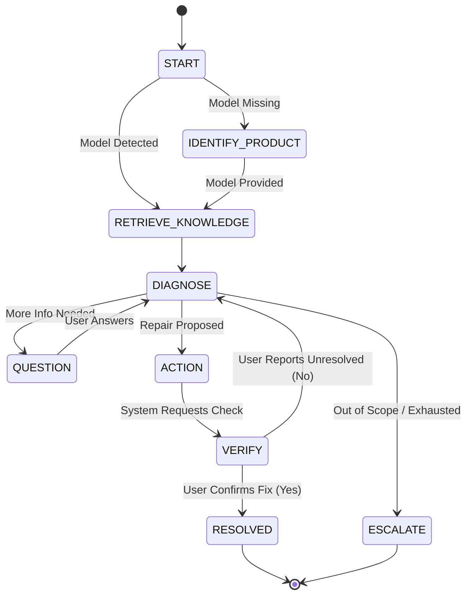
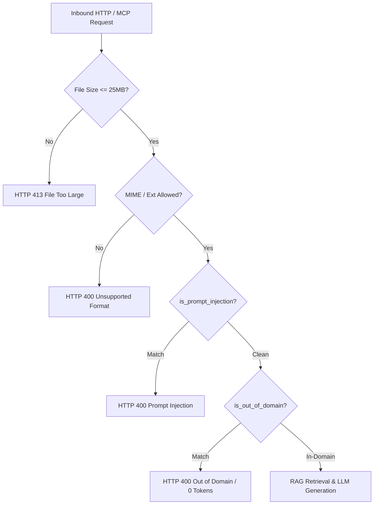
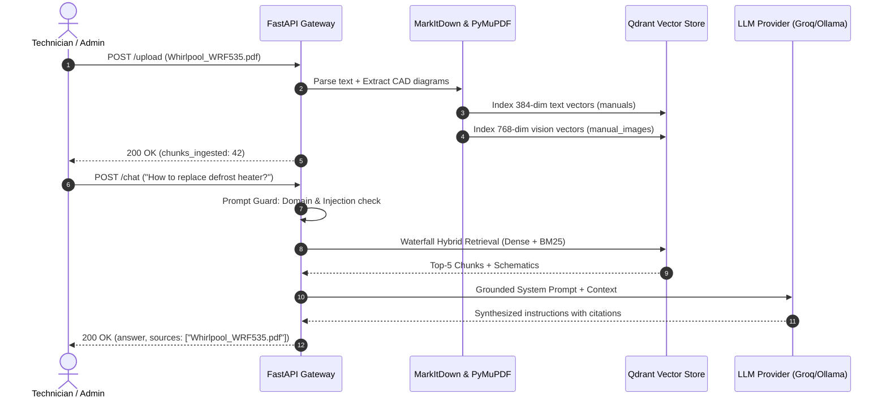
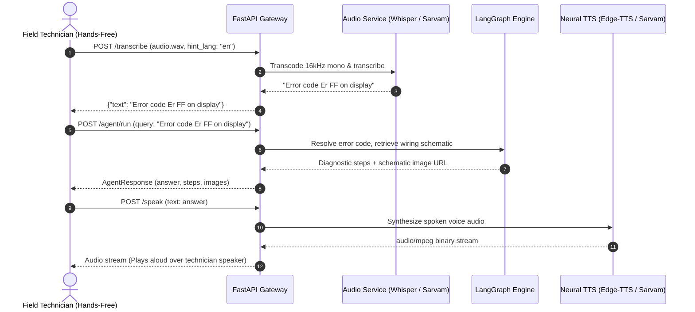

# OCTO-RAG Assistant & Diagnostic Server — API Documentation

Comprehensive, authoritative technical reference for the **OCTO-RAG** REST API gateway and native **Model Context Protocol (MCP)** diagnostic server.

---

## Table of Contents

1. [API Overview](#1-api-overview)
2. [Base URL & Server Configuration](#2-base-url--server-configuration)
3. [API Conventions & Protocols](#3-api-conventions--protocols)
4. [Endpoint Reference Matrix](#4-endpoint-reference-matrix)
5. [Chat & Streaming APIs](#5-chat--streaming-apis)
   - [POST /chat](#post-chat)
   - [POST /chat/stream](#post-chatstream)
6. [Document Ingestion & File Management](#6-document-ingestion--file-management)
   - [POST /upload](#post-upload)
   - [GET /files](#get-files)
   - [DELETE /files/{filename}](#delete-filesfilename)
   - [POST /admin/reset](#post-adminreset)
   - [GET /products](#get-products)
   - [GET /debug_qdrant](#get-debug_qdrant)
7. [Agent Execution API](#7-agent-execution-api)
   - [POST /agent/run](#post-agentrun)
8. [Troubleshooting & Session Management](#8-troubleshooting--session-management)
   - [POST /troubleshoot](#post-troubleshoot)
   - [GET /sessions](#get-sessions)
   - [POST /sessions](#post-sessions)
   - [GET /sessions/{session_id}](#get-sessionssession_id)
   - [DELETE /sessions/{session_id}](#delete-sessionssession_id)
9. [Voice & Speech APIs](#9-voice--speech-apis)
   - [POST /transcribe](#post-transcribe)
   - [POST /speak](#post-speak)
10. [Document Image & Media Asset API](#10-document-image--media-asset-api)
    - [GET /document-images/{document_id}/{image_id}](#get-document-imagesdocument_idimage_id)
11. [System Telemetry & Health Checks](#11-system-telemetry--health-checks)
    - [GET /health](#get-health)
    - [GET /health/llm](#get-healthllm)
12. [Model Context Protocol (MCP) Integration](#12-model-context-protocol-mcp-integration)
    - [Architecture & Protocol Mount](#architecture--protocol-mount)
    - [Tool 1: search_fridge_manuals](#tool-1-search_fridge_manuals)
    - [Tool 2: lookup_error_code](#tool-2-lookup_error_code)
    - [Tool 3: get_thermistor_ohm_table](#tool-3-get_thermistor_ohm_table)
    - [Tool 4: lookup_part_number](#tool-4-lookup_part_number)
    - [Tool 5: run_octo_agent](#tool-5-run_octo_agent)
    - [Tool 6: troubleshoot_appliance_turn](#tool-6-troubleshoot_appliance_turn)
13. [Security, Domain Boundaries & Rate Limiting](#13-security-domain-boundaries--rate-limiting)
14. [Error Handling & HTTP Status Codes](#14-error-handling--http-status-codes)
15. [End-to-End API Workflows](#15-end-to-end-api-workflows)
16. [Verification & Testing Guide](#16-verification--testing-guide)
17. [Interactive API Explorers (Swagger & ReDoc)](#17-interactive-api-explorers-swagger--redoc)
18. [API Changelog](#18-api-changelog)

---

## 1. API Overview

OCTO-RAG provides an asynchronous backend microservice built with **FastAPI** (`v3.0.0`) designed for enterprise appliance maintenance, field technician support, and diagnostic intelligence. The service unifies:

- **Multimodal RAG Retrieval**: Dense vector search (SentenceTransformers `all-MiniLM-L6-v2`) combined with sparse in-memory BM25 scoring via Reciprocal Rank Fusion (RRF, $k=60$) across 3 waterfall tiers (`Exact Product` $\rightarrow$ `Family Prefix` $\rightarrow$ `Global Manuals`).
- **Google SigLIP 2 Vision Retrieval**: Semantic cross-modal indexing and query-to-diagram matching for technical electrical diagrams and CAD schematics.
- **Stateful Troubleshooting Engine**: SOP-guided diagnostic progression (`START` $\rightarrow$ `IDENTIFY_PRODUCT` $\rightarrow$ `RETRIEVE_KNOWLEDGE` $\rightarrow$ `DIAGNOSE` $\rightarrow$ `QUESTION` $\rightarrow$ `ACTION` $\rightarrow$ `VERIFY` $\rightarrow$ `RESOLVED`/`ESCALATE`).
- **Resilient Hybrid LLM Gateway**: Local offline Ollama prioritization (`qwen2.5:3b`, `gemma3:4b`, `llama3.2:3b`) with automated fallback to cloud inference engines (Groq `qwen/qwen3.8-27b`, SambaNova `Meta-Llama-3.3-70B-Instruct`).
- **Hybrid Multilingual Voice Support**: Local `faster-whisper` (`int8` CPU) alongside Sarvam AI (`Saaras v3`) for Indic regional transcription, and Microsoft `edge-tts` / Sarvam AI (`Bulbul v3`) for neural text-to-speech.
- **Model Context Protocol (MCP)**: Native FastMCP implementation exposing diagnostic tools over Server-Sent Events (`/mcp/sse`) and standard I/O for Claude Desktop and IDEs.

---

## 2. Base URL & Server Configuration

### Default Development Base URLs

| Service / Interface | Base URL | Transport | Notes |
| :--- | :--- | :--- | :--- |
| **REST API Server** | `http://127.0.0.1:8000` or `http://localhost:8000` | HTTP / HTTPS | FastAPI ASGI application (`uvicorn app.main:app`) |
| **MCP SSE Endpoint** | `http://127.0.0.1:8000/mcp/sse` | HTTP SSE | Model Context Protocol SSE stream |
| **Frontend Web Console** | `http://localhost:3000` | HTTP | Next.js 14 Web Application |

### Network & Startup Architecture

- **Lifespan Initialization**: On boot, FastAPI executes a warmup routine (`lifespan`) pre-loading both text (`SentenceTransformer`) and vision (`SigLIP 2`) models into memory to prevent latency spikes on first client requests.
- **CORS Policy**: Configured via `CORSMiddleware`. By default, origins are constrained to `http://localhost:3000` with `allow_credentials=True`, `allow_methods=["*"]`, and `allow_headers=["*"]`.
- **Authentication**: `Not specified in the current implementation`. All routes are accessed unauthenticated at the transport layer, with network protection provided by IP rate limiters and origin filtering.

---

## 3. API Conventions & Protocols

- **Content-Type**:
  - Request payloads default to `application/json` unless handling binary audio or multipart file ingestion (`multipart/form-data`).
  - Response payloads default to `application/json; charset=utf-8`.
  - Streaming endpoints utilize `text/event-stream`.
  - Speech endpoints return raw binary audio (`audio/mpeg` or `audio/wav`).
- **Character Encoding**: UTF-8 throughout all string attributes.
- **Rate Limit Headers**: Managed via `slowapi` (`get_remote_address`). Rate-limit headers (e.g., `X-RateLimit-Limit`, `X-RateLimit-Remaining`, `X-RateLimit-Reset`) are sent with HTTP responses. If exhausted, status code `429 Too Many Requests` is returned.
- **Domain Boundaries**: Technical queries submitted to `/chat`, `/chat/stream`, `/troubleshoot`, and `/agent/run` pass through a Pre-LLM gateway regex filter. Inquiries outside the refrigerator and cooling appliance domain are immediately rejected with `400 Bad Request`, consuming 0 LLM tokens.

---

## 4. Endpoint Reference Matrix

| Method | Endpoint Path | Primary Purpose | Rate Limit | Request Format | Response Model / Type |
| :--- | :--- | :--- | :--- | :--- | :--- |
| `GET` | `/health` | Server & vector count health check | None | None | `HealthResponse` (JSON) |
| `GET` | `/health/llm` | Detailed LLM telemetry & fallback status | None | None | `dict` (JSON) |
| `GET` | `/files` | List all unique ingested manual files | None | None | `{"files": [...]}` (JSON) |
| `DELETE` | `/files/{filename}` | Completely delete a manual, vectors & images | None | Path Parameter | `{"status": ..., "filename": ...}` |
| `POST` | `/admin/reset` | Complete database & storage hard reset | None | None | `{"status": ..., "message": ...}` |
| `GET` | `/debug_qdrant` | Vector distribution by document payload | None | None | `{"total": ..., "sources_count": ...}` |
| `GET` | `/products` | List all unique product models in index | None | None | `{"products": [...]}` (JSON) |
| `POST` | `/chat` | Standard multi-turn grounded RAG chat | `20/minute` | `ChatRequest` (JSON) | `ChatResponse` (JSON) |
| `POST` | `/chat/stream` | Low-latency token-streaming SSE endpoint | `30/minute` | `ChatRequest` (JSON) | `text/event-stream` (SSE) |
| `POST` | `/upload` | Parse, chunk, embed & index document | `60/minute` | `multipart/form-data` | `UploadResponse` (JSON) |
| `POST` | `/transcribe` | Convert speech audio to text (Whisper/Sarvam)| `60/minute` | `multipart/form-data` | `{"text": ..., "detected_language": ...}` |
| `GET` | `/document-images/{doc_id}/{img_id}`| Retrieve extracted schematic image | `60/minute` | Path Parameters | `FileResponse` (PNG/JPEG) |
| `POST` | `/speak` | Synthesize text to spoken audio (Edge/Sarvam) | `20/minute` | `SpeakRequest` (JSON) | Binary Audio (`audio/mpeg` or `audio/wav`) |
| `POST` | `/troubleshoot` | Multi-turn state-guided SOP troubleshooting | `20/minute` | `TroubleshootRequest` | State Machine Response (JSON) |
| `POST` | `/agent/run` | Unified LangGraph execution pipeline | `10/minute` | `AgentRequest` (JSON) | `AgentResponse` (JSON) |
| `GET` | `/sessions` | List saved conversation sessions by user | None | Query Parameter | `{"sessions": [...]}` (JSON) |
| `GET` | `/sessions/{session_id}` | Retrieve specific session messages & state | None | Path Parameter | Session State Dictionary (JSON) |
| `POST` | `/sessions` | Save or update conversation history | None | `SessionPayload` (JSON)| `{"status": "ok", "session_id": ...}` |
| `DELETE` | `/sessions/{session_id}` | Delete conversation session from store | None | Path Parameter | `{"status": "deleted", "session_id": ...}` |
| `GET` | `/mcp/sse` | FastMCP Server-Sent Events transport | None | None | MCP JSON-RPC over SSE |

---

## 5. Chat & Streaming APIs

### POST /chat

Executes the Phase 1 & 2 RAG pipeline: Query Understanding $\rightarrow$ Prompt Guard $\rightarrow$ 3-Level Waterfall Hybrid Retrieval (Dense + BM25) $\rightarrow$ Confidence Evaluation $\rightarrow$ Prompt Construction $\rightarrow$ Unified LLM Generation.

- **HTTP Method**: `POST`
- **Path**: `/chat`
- **Rate Limit**: `20/minute`
- **Headers**:
  - `Content-Type: application/json`

#### Request Parameters

| Field | Type | Required | Constraints | Description |
| :--- | :--- | :--- | :--- | :--- |
| `message` | `string` | **Yes** | Min 1 char, Max 4000 chars | The user inquiry, symptom, or technical question. |
| `source_file` | `string` | No | Default: `None` | Restrict search exclusively to a specific manual file. |
| `session_id` | `string` | No | Default: `None` | Session UUID for multi-turn clarification tracking. |

#### Request Example

```json
{
  "message": "What is the recommended freezer temperature setting?",
  "source_file": "GE_Profile_Refrigerator.pdf",
  "session_id": "9b1deb4d-3b7d-4bad-9bdd-2b0d7b3dcb6d"
}
```

#### Response Fields (`ChatResponse`)

| Field | Type | Description |
| :--- | :--- | :--- |
| `answer` | `string` | Synthesized grounded answer or fallback guidance. |
| `sources` | `list[string]` | Distinct source manual citations associated with answer context. |
| `needs_clarification`| `boolean` | `true` if query was ambiguous or product mismatch requires input. |
| `clarification_question` | `string` or `null`| Specific clarification prompt when `needs_clarification` is `true`. |

#### Response Example (Success — 200 OK)

```json
{
  "answer": "The recommended freezer compartment temperature setting is **0°F (-18°C)**. For the fresh food compartment, set the control to **37°F (3°C)**. Allow 24 hours for temperatures to stabilize after adjustment.",
  "sources": [
    "GE_Profile_Refrigerator.pdf"
  ],
  "needs_clarification": false,
  "clarification_question": null
}
```

#### Response Example (Clarification Required — 200 OK)

```json
{
  "answer": "I found some information for B300, but you asked about A200. Should I proceed with the details for B300?",
  "sources": [],
  "needs_clarification": true,
  "clarification_question": "I found some information for B300, but you asked about A200. Should I proceed with the details for B300?"
}
```

#### Error Responses

- `400 Bad Request`:
  - `{"detail": "Potential prompt injection detected."}`
  - `{"detail": "I am specialized strictly in refrigerator and cooling appliance technical support. Please ask a query related to your refrigerator manual."}`
- `429 Too Many Requests`: Rate limit exceeded (`20/minute`).
- `503 Service Unavailable`: LLM provider unreachable and no fallback configured.

---

### POST /chat/stream

Low Time-to-First-Token (TTFT) streaming endpoint utilizing Server-Sent Events (SSE) to deliver generated responses word-by-word.

- **HTTP Method**: `POST`
- **Path**: `/chat/stream`
- **Rate Limit**: `30/minute`
- **Headers**:
  - `Content-Type: application/json`
  - `Accept: text/event-stream`
- **Request Body**: `ChatRequest` (identical to `POST /chat`).

#### Stream Event Structure

Chunks are emitted formatted as SSE `data:` payloads separated by double newlines:

```text
data: The
data:  recommended
data:  freezer
data:  temperature
data:  is
data:  **0°F**.
data: [DONE]
```

- When generation terminates, the sentinel token `data: [DONE]\n\n` is transmitted.
- If retrieval confidence is `LOW`, a single fallback chunk is emitted followed by stream termination.

---

## 6. Document Ingestion & File Management

### POST /upload

Ingests, converts, chunks, embeds, and indexes a technical document into both text and vision vector collections.

- **HTTP Method**: `POST`
- **Path**: `/upload`
- **Rate Limit**: `60/minute`
- **Content-Type**: `multipart/form-data`

#### Multipart Form Fields

| Field Name | Type | Required | Constraints | Description |
| :--- | :--- | :--- | :--- | :--- |
| `file` | `UploadFile` | **Yes** | Max 25MB (26,214,400 bytes) | Technical manual binary file. |

#### Allowed File Extensions & MIME Types

| Extension | Allowed MIME Types |
| :--- | :--- |
| `.pdf` | `application/pdf` |
| `.docx` | `application/vnd.openxmlformats-officedocument.wordprocessingml.document` |
| `.ppt` | `application/vnd.ms-powerpoint` |
| `.pptx` | `application/vnd.openxmlformats-officedocument.presentationml.presentation` |
| `.xls` | `application/vnd.ms-excel` |
| `.xlsx` | `application/vnd.openxmlformats-officedocument.spreadsheetml.sheet` |
| `.txt` | `text/plain` |

#### Ingestion Pipeline Workflow

1. Validates file size $\le 25\text{MB}$ and format whitelist.
2. Computes MD5 checksum; verifies against SQLite `registry.db` to prevent duplicate processing of identical files.
3. Microsoft **MarkItDown** standardizes formatting into Markdown text.
4. **PyMuPDF** extracts raster schematics and renders vector CAD drawings.
5. Perceptual hashing (`pHash`) and aspect ratio filters drop repetitive logos and decorative rules.
6. **SentenceTransformers** (`all-MiniLM-L6-v2`) writes 384-dimensional text vectors to Qdrant collection `manuals`.
7. **SigLIP 2** (`google/siglip-base-patch16-224`) writes 768-dimensional vision embeddings to Qdrant collection `manual_images`.

#### Response Example (`UploadResponse` — 200 OK)

```json
{
  "filename": "Whirlpool_WRF535_Manual.pdf",
  "markdown_file": "Whirlpool_WRF535_Manual.md",
  "chunks_ingested": 42,
  "status": "processed"
}
```

#### Error Responses

- `400 Bad Request`: `{"detail": "No file selected"}` or `{"detail": "Unsupported format. Supported: .docx, .pdf, .ppt, .pptx, .txt, .xls, .xlsx"}`
- `413 Request Entity Too Large`: `{"detail": "File is too large. Max size allowed is 25MB."}`
- `500 Internal Server Error`: Parsing or embedding pipeline failure.

---

### GET /files

Returns an alphabetical list of all unique manuals indexed in Qdrant or present on disk in `data_sandbox/input_manuals`.

- **HTTP Method**: `GET`
- **Path**: `/files`
- **Response Example (200 OK)**:

```json
{
  "files": [
    "GE_Profile_Fridge.pdf",
    "Samsung_FrenchDoor_ServiceManual.pdf",
    "Whirlpool_WRF535_Manual.pdf"
  ]
}
```

---

### DELETE /files/{filename}

Performs an atomic, complete purge of a specific manual across all application layers:
1. Deletes raw file from `data_sandbox/input_manuals/`.
2. Deletes converted markdown from `data_sandbox/processed_markdown/`.
3. Deletes extracted figures from `data_sandbox/processed_markdown/images/{base_name}`.
4. Deletes text vector points from Qdrant collection `manuals`.
5. Deletes visual schematic points from Qdrant collection `manual_images`.
6. Removes registration hash from SQLite `registry.db`.
7. Clears in-memory LRU retrieval cache.

- **HTTP Method**: `DELETE`
- **Path**: `/files/{filename}`
- **Path Parameter**: `filename` (`string`, required) — The name of the file to remove (e.g. `test1.pdf`).
- **Response Example (200 OK)**:

```json
{
  "status": "deleted",
  "filename": "test1.pdf"
}
```

---

### POST /admin/reset

Administrative hard reset. Completely purges all input manuals, processed markdown documents, extracted images, Qdrant vectors across both collections, and SQLite registry records.

- **HTTP Method**: `POST`
- **Path**: `/admin/reset`
- **Response Example (200 OK)**:

```json
{
  "status": "ok",
  "message": "All manuals and index data successfully wiped."
}
```

---

### GET /products

Returns a list of all distinct product model identifiers extracted from manual payloads in Qdrant.

- **HTTP Method**: `GET`
- **Path**: `/products`
- **Response Example (200 OK)**:

```json
{
  "products": [
    "A200",
    "GE Profile",
    "WRF535",
    "X100"
  ]
}
```

---

### GET /debug_qdrant

Internal diagnostic endpoint inspecting vector payload density and distribution across documents.

- **HTTP Method**: `GET`
- **Path**: `/debug_qdrant`
- **Response Example (200 OK)**:

```json
{
  "total": 145,
  "sources_count": {
    "GE_Profile_Fridge.pdf": 82,
    "Whirlpool_WRF535_Manual.pdf": 63
  }
}
```

---

## 7. Agent Execution API

### POST /agent/run

Executes the unified **LangGraph `StateGraph`** agentic workflow (`agent_flow.py`). Designed for autonomous diagnostic workflows, technical scraping, and multimodal response generation with grounded visual diagrams.

- **HTTP Method**: `POST`
- **Path**: `/agent/run`
- **Rate Limit**: `10/minute`
- **Headers**:
  - `Content-Type: application/json`

#### Request Parameters (`AgentRequest`)

| Field | Type | Required | Description |
| :--- | :--- | :--- | :--- |
| `query` | `string` | **Yes** | Technical query or symptom description. |
| `source_input` | `string` | No | Optional URL to scrape or local filename to bind. |
| `session_id` | `string` | No | Session identifier (auto-generates UUID if omitted). |

#### Request Example

```json
{
  "query": "How do I test the defrost heater on model GE Profile?",
  "source_input": "GE_Profile_Fridge.pdf",
  "session_id": "sess-field-tech-42"
}
```

#### Response Fields (`AgentResponse`)

| Field | Type | Description |
| :--- | :--- | :--- |
| `answer` | `string` | Synthesized technical explanation with bolded values and procedure. |
| `steps` | `list[string]` | Ordered sequential maintenance or diagnostic steps. |
| `sources` | `list[object]` | Chunk metadata objects detailing source file, page number, and score. |
| `product_id` | `string` or `null` | Extracted product or model identification string. |
| `clarification_needed` | `boolean` | Indicates whether query was underspecified. |
| `clarification_question`| `string` or `null` | Clarification text prompt if needed. |
| `status` | `string` or `null` | Lifecycle outcome (`qa`, `troubleshoot`, etc.). |
| `version_info` | `string` or `null` | Document version hash details if source was ingested. |
| `images` | `list[object]` | Associated visual diagram cards matching query context. |

#### Response Example (200 OK)

```json
{
  "answer": "To test the defrost heater on the **GE Profile**, disconnect power, locate the heater at the bottom of the evaporator coil, and measure resistance across the terminal pins using a multimeter set to the lowest ohms range. A functional 120V heater should read between **20 to 35 Ohms**. An infinite reading indicates an open circuit.",
  "steps": [
    "Unplug refrigerator from electrical outlet",
    "Remove freezer rear evaporator cover panel",
    "Disconnect wiring harness from both heater terminals",
    "Measure resistance across terminals using multimeter"
  ],
  "sources": [
    {
      "source": "GE_Profile_Fridge.pdf",
      "page": 14,
      "rrf_score": 0.0322
    }
  ],
  "product_id": "GE Profile",
  "clarification_needed": false,
  "clarification_question": null,
  "status": "qa",
  "version_info": null,
  "images": [
    {
      "image_id": "ge_profile_p14_df0291",
      "document_id": "GE_Profile_Fridge",
      "page": 14,
      "caption": "Defrost Heater Assembly & Terminal Pins",
      "image_url": "/document-images/GE_Profile_Fridge/ge_profile_p14_df0291"
    }
  ]
}
```

---

## 8. Troubleshooting & Session Management

### POST /troubleshoot

Multi-turn, state-guided diagnostic endpoint implementing a bounded Standard Operating Procedure (SOP) state machine.

- **HTTP Method**: `POST`
- **Path**: `/troubleshoot`
- **Rate Limit**: `20/minute`
- **Headers**:
  - `Content-Type: application/json`

#### Request Parameters (`TroubleshootRequest`)

| Field | Type | Required | Constraints | Description |
| :--- | :--- | :--- | :--- | :--- |
| `session_id` | `string` | **Yes** | 1 to 100 characters | Persistent session ID for tracking history across turns. |
| `message` | `string` | **Yes** | 1 to 4000 characters | Initial symptom, product answer, or `Yes`/`No` action feedback. |

#### State Machine Progression Flow



#### Response Structure

Responses return a JSON dictionary containing the new `status` and contextual payload:

```json
{
  "status": "action",
  "action": "Inspect the condenser fan motor located next to the compressor. Remove any lint or obstruction blocking the blades and confirm the fan spins freely by hand.",
  "session": {
    "session_id": "tech-session-001",
    "product": "Whirlpool WRF535",
    "issue": "not cooling",
    "step": 2,
    "status": "ACTION",
    "history": [
      {
        "question": "Is the compressor running and warm to the touch?",
        "answer": "Yes, compressor is running but coils are room temperature."
      }
    ]
  }
}
```

Possible response `status` values:
- `"question"`: Additional symptom details or measurements required. Field: `question`.
- `"action"`: Specific physical check, multimeter test, or part replacement proposed. Field: `action`.
- `"verify"`: System verifies if the proposed action fixed the problem. Field: `question` (e.g. *"Did this action resolve the issue? Please reply Yes or No."*).
- `"resolved"`: Issue confirmed fixed. Field: `message`.
- `"escalate"`: Procedures exhausted or dangerous condition. Recommends Tier-3 field engineer escalation. Field: `message`.

---

### GET /sessions

Lists chat conversations for a given user, ordered by most recently updated.

- **HTTP Method**: `GET`
- **Path**: `/sessions`
- **Query Parameter**: `user_id` (`string`, optional, default: `"default_user"`)
- **Response Example (200 OK)**:

```json
{
  "sessions": [
    {
      "session_id": "tech-session-001",
      "user_id": "default_user",
      "title": "Defrost Heater Testing",
      "created_at": 1727254800.0,
      "updated_at": 1727255100.0,
      "message_count": 6,
      "last_message": "Defrost heater reading 28 ohms.",
      "product": "GE Profile",
      "status": "RESOLVED"
    }
  ]
}
```

---

### POST /sessions

Creates or updates conversation history and state in the session store.

- **HTTP Method**: `POST`
- **Path**: `/sessions`
- **Headers**: `Content-Type: application/json`

#### Request Parameters (`SessionPayload`)

| Field | Type | Required | Description |
| :--- | :--- | :--- | :--- |
| `session_id` | `string` | **Yes** | Target session identifier. |
| `user_id` | `string` | No | Defaults to `"default_user"`. |
| `title` | `string` | No | Human-readable title for sidebar display. |
| `messages` | `list[object]` | No | Full list of conversation turn messages. |
| `product` | `string` | No | Active product model tag. |
| `status` | `string` | No | Current session state string. |

#### Response Example (200 OK)

```json
{
  "status": "ok",
  "session_id": "tech-session-001"
}
```

---

### GET /sessions/{session_id}

Retrieves full conversation turns, state variables, and history for a specific session.

- **HTTP Method**: `GET`
- **Path**: `/sessions/{session_id}`
- **Path Parameter**: `session_id` (`string`, required)
- **Response**: Returns session dictionary or `404 Not Found` if missing.

---

### DELETE /sessions/{session_id}

Deletes a conversation session from the registry.

- **HTTP Method**: `DELETE`
- **Path**: `/sessions/{session_id}`
- **Response Example (200 OK)**:

```json
{
  "status": "deleted",
  "session_id": "tech-session-001"
}
```

---

## 9. Voice & Speech APIs

### POST /transcribe

Transcribes uploaded audio into text using hybrid speech-to-text engines:
- English audio routes to local `faster-whisper` (`small` model, `int8` CPU).
- Indian regional language audio routes to **Sarvam AI (`Saaras v3`) API**.

- **HTTP Method**: `POST`
- **Path**: `/transcribe`
- **Rate Limit**: `60/minute`
- **Content-Type**: `multipart/form-data`

#### Form Parameters

| Field | Type | Required | Default | Description |
| :--- | :--- | :--- | :--- | :--- |
| `audio` | `UploadFile` | **Yes** | — | Binary audio recording (WAV, WEBM, MP3, OGG, M4A). |
| `hint_lang` | `string` | No | `"auto"` | Language code hint (`en`, `hi`, `ta`, `te`, `kn`, `ml`, `bn`, `mr`, `auto`). |

#### Response Example (200 OK)

```json
{
  "text": "The freezer evaporator fan is making a loud buzzing noise.",
  "detected_language": "en"
}
```

---

### POST /speak

Synthesizes textual diagnostic steps into natural spoken audio.
- Automatically cleans markdown headers, asterisks, bullet points, and source citations before speaking.
- Routes Indian languages to **Sarvam AI (`Bulbul v3`)** (`audio/wav`).
- Routes English and other languages to **Microsoft `edge-tts`** neural voices (`audio/mpeg`).

- **HTTP Method**: `POST`
- **Path**: `/speak`
- **Rate Limit**: `20/minute`
- **Headers**:
  - `Content-Type: application/json`

#### Request Parameters (`SpeakRequest`)

| Field | Type | Required | Constraints | Description |
| :--- | :--- | :--- | :--- | :--- |
| `text` | `string` | **Yes** | 1 to 4000 characters | Text to synthesize into speech. |
| `language` | `string` | No | Default: `"auto"` | Language code (`en`, `hi`, `ta`, `te`, `kn`, etc.). |

#### Response

- **Status Code**: `200 OK`
- **Content-Type**: `audio/mpeg` (Edge-TTS) or `audio/wav` (Sarvam AI)
- **Body**: Raw audio binary stream.

---

## 10. Document Image & Media Asset API

### GET /document-images/{document_id}/{image_id}

Safely streams extracted schematic PNG/JPEG images for visual display in technician answer cards.

- **HTTP Method**: `GET`
- **Path**: `/document-images/{document_id}/{image_id}`
- **Rate Limit**: `60/minute`

#### Path Parameters

| Parameter | Type | Required | Constraints |
| :--- | :--- | :--- | :--- |
| `document_id` | `string` | **Yes** | Regex `^[a-zA-Z0-9_-]+$` |
| `image_id` | `string` | **Yes** | Regex `^[a-zA-Z0-9_-]+$` |

#### Security Checks

1. **Strict Regex Sanitization**: Characters outside `[a-zA-Z0-9_-]` immediately return `404 Not Found`.
2. **Path Traversal Guards**: Validates that resolved target paths strictly reside within the canonical `data_sandbox/processed_markdown/images/` directory.
3. **Metadata Verification**: Ensures the image record exists in the document's `metadata.json` before serving.

- **Response**: `FileResponse` streaming the image file with appropriate media type (`image/png`, `image/jpeg`).

---

## 11. System Telemetry & Health Checks

### GET /health

Basic liveness and capacity endpoint.

- **HTTP Method**: `GET`
- **Path**: `/health`
- **Response Fields (`HealthResponse`)**:
  - `status`: Always `"ok"`.
  - `llm_provider`: Currently active LLM provider (`"ollama"`, `"groq"`, or `"sambanova"`).
  - `vectors_stored`: Total number of chunk vector points in Qdrant `manuals`.

#### Response Example (200 OK)

```json
{
  "status": "ok",
  "llm_provider": "groq",
  "vectors_stored": 560
}
```

---

### GET /health/llm

Deep telemetry endpoint providing status on local Ollama connectivity, task model mappings, and cloud fallback metrics.

- **HTTP Method**: `GET`
- **Path**: `/health/llm`
- **Response Example (200 OK)**:

```json
{
  "status": "ok",
  "primary_provider": "ollama",
  "ollama_enabled": false,
  "ollama_base_url": "http://127.0.0.1:11434",
  "ollama_reachable": true,
  "cloud_fallback_provider": "groq",
  "cloud_fallback_model": "qwen/qwen3.8-27b",
  "last_provider_used": "groq",
  "last_model_used": "qwen/qwen3.8-27b",
  "last_task": "chat",
  "last_error": null,
  "last_fallback_reason": "Ollama disabled by configuration",
  "task_models": {
    "classification": "qwen2.5:3b",
    "chat": "gemma3:4b",
    "workflow": "llama3.2:3b",
    "caption": "gemma3:4b"
  },
  "stats": {
    "total_requests": 14,
    "ollama_served": 0,
    "cloud_fallback_served": 14
  }
}
```

---

## 12. Model Context Protocol (MCP) Integration

### Architecture & Protocol Mount

OCTO-RAG implements a native **FastMCP** server (`backend/app/mcp/fridge_mcp_server.py`) conforming to Anthropic's open Model Context Protocol specification. The MCP server is mounted directly into FastAPI:

```python
app.mount("/mcp", fridge_mcp_server.sse_app())
```

- **Transport 1: Server-Sent Events (SSE)**: Exposed at `GET http://localhost:8000/mcp/sse`.
- **Transport 2: Standard I/O (stdio)**: Can be spawned directly by desktop clients via `python backend/app/mcp/fridge_mcp_server.py`.

#### Claude Desktop Configuration (`claude_desktop_config.json`)

```json
{
  "mcpServers": {
    "octo-rag": {
      "command": "C:\\Users\\SAMSUNG\\AppData\\Local\\Programs\\Python\\Python311\\python.exe",
      "args": [
        "C:\\Users\\SAMSUNG\\OneDrive\\Desktop\\rag-multimodal-assistant\\backend\\app\\mcp\\fridge_mcp_server.py"
      ]
    }
  }
}
```

---

### Tool 1: search_fridge_manuals

Performs grounded hybrid retrieval across indexed refrigerator manuals in Qdrant.

- **Parameters**:
  - `query` (`string`, required): Search prompt or question.
  - `source_file` (`string`, optional, default `""`): Filter by specific manual filename.
- **Output**: Formatted string with confidence rating and chunk citations (`--- Chunk 1 [Source: ... | Page: ...] ---`).
- **Example Call**:
  ```json
  {"query": "defrost drain tube cleaning", "source_file": ""}
  ```

---

### Tool 2: lookup_error_code

Resolves refrigerator control panel error codes to PCB pinouts, multimeter procedures, and repair instructions.

- **Parameters**:
  - `brand` (`string`, required): Manufacturer (e.g. `GE`, `Samsung`, `LG`, `Whirlpool`).
  - `model` (`string`, required): Appliance model series (e.g. `Profile`, `French Door`).
  - `code` (`string`, required): Displayed code (e.g. `Er FF`, `SY EF`, `22 E`, `E5`, `88 88`).
- **Output (`dict`)**:
  - `component`: Failing assembly.
  - `description`: Technical explanation of fault trigger.
  - `test_procedure`: Multimeter test points and expected voltages.
  - `recommended_action`: Repair or part replacement SOP.
  - `status`: `"FOUND"` or `"GENERIC_FALLBACK"`.

#### Output Example

```json
{
  "brand": "GE",
  "model": "Profile",
  "code": "ER FF",
  "status": "FOUND",
  "component": "Evaporator Fan Motor",
  "description": "Freezer Evaporator Fan Motor failure or ice blockage detected.",
  "test_procedure": "Measure voltage between Fan Signal Pin & GND on PCB (Expected: 12V DC). Check fan blade rotation for ice buildup.",
  "recommended_action": "Thaw ice blockage, test fan motor resistance (approx 1.5 - 3.0 kOhm across coil), replace motor if open loop."
}
```

---

### Tool 3: get_thermistor_ohm_table

Calculates expected NTC thermistor resistance using the Steinhart-Hart equation ($R_0=10\text{k}\Omega$, $T_0=298.15\text{K}$, $\beta=3950\text{K}$) for multimeter diagnosis.

- **Parameters**:
  - `temp_celsius` (`float`, required): Test temperature in °C (e.g., `-20.0` for freezer, `0.0` for ice bath test, `25.0` for room temp).
- **Output (`dict`)**:
  - `temperature_celsius`: Celsius temperature tested.
  - `temperature_fahrenheit`: Converted Fahrenheit temperature.
  - `expected_resistance_kohm`: Expected resistance in kilo-Ohms ($k\Omega$).
  - `multimeter_setting`: Recommended meter scale setting.
  - `testing_instruction`: Practical probe instructions and failure criteria.

#### Output Example

```json
{
  "temperature_celsius": 0.0,
  "temperature_fahrenheit": 32.0,
  "expected_resistance_kohm": 32.65,
  "multimeter_setting": "200kOhm Resistance (Ohms)",
  "testing_instruction": "Place multimeter probes on thermistor leads. At 0.0°C (32.0°F), meter should read approx 32.65 kOhm. Reading 0 Ohm indicates short circuit; infinite reading indicates open wire.",
  "status": "OK"
}
```

---

### Tool 4: lookup_part_number

Resolves OEM replacement part numbers, electrical ratings, and repair difficulty levels.

- **Parameters**:
  - `model` (`string`, required): Appliance model (e.g. `'GE Profile'`).
  - `component_name` (`string`, required): Description (e.g. `'defrost heater'`, `'start relay'`, `'water valve'`, `'fan'`, `'control board'`).
- **Output (`dict`)**:
  - `oem_part_number`: Manufacturer OEM part number.
  - `official_name`: Full component catalog title.
  - `electrical_specs`: Operating voltage and wattage specifications.
  - `repair_difficulty`: Difficulty rating (`Easy`, `Moderate`, `Complex`).
  - `status`: `"MATCH_FOUND"` or `"GENERIC_LOOKUP"`.

#### Output Example

```json
{
  "searched_model": "GE Profile",
  "searched_component": "defrost heater",
  "oem_part_number": "WR51X10055",
  "official_name": "Glass Tube Defrost Heater Assembly",
  "electrical_specs": "120V AC, 525W",
  "repair_difficulty": "Moderate",
  "status": "MATCH_FOUND"
}
```

---

### Tool 5: run_octo_agent

Executes the complete LangGraph agent flow from within Claude Desktop or MCP clients.

- **Parameters**:
  - `query` (`string`, required): Technical query.
  - `source_input` (`string`, optional, default `""`): Optional manual or URL.
  - `session_id` (`string`, optional, default `""`): Session identifier.
- **Output (`dict`)**: Full `AgentResponse` dictionary including `answer`, `steps`, `sources`, `product_id`, and `images`.

---

### Tool 6: troubleshoot_appliance_turn

Executes an interactive turn of the stateful troubleshooting engine.

- **Parameters**:
  - `session_id` (`string`, required): Persistent troubleshooting session ID.
  - `message` (`string`, required): User response or diagnostic test outcome.
- **Output (`dict`)**: Diagnostic state dictionary containing `status`, `question`/`action`, and updated session state.

---

## 13. Security, Domain Boundaries & Rate Limiting

### Pre-LLM Security Architecture



### 1. Prompt Injection Defenses (`is_prompt_injection`)

Matches patterns attempting system role override, secret leakage, or developer directive reset:
- `ignore previous instructions`, `system prompt`, `developer message`, `reveal hidden prompt`, `override rules`, `bypass restrictions`.
- Triggers `HTTP 400 Bad Request`.

### 2. Domain Boundary Guardrails (`is_out_of_domain`)

Blocks off-topic queries before any vector database or LLM invocation:
- **In-Domain Whitelist**: Refrigerator, freezer, cooler, chiller, ice maker, defrost, compressor, evaporator, condenser, thermostat, door seal, refrigerant, cooling, temperature.
- **Out-of-Domain Blacklist**: Automotive, recipes/cooking, non-cooling appliances (washers, dryers, ovens, TVs), finance/crypto, politics, creative writing (poems, jokes, stories).
- **Benefit**: **0 LLM API tokens** are consumed by off-topic queries.

### 3. Rate Limiting Rules (`slowapi`)

| Endpoint | Method | Rate Limit | Scope |
| :--- | :--- | :--- | :--- |
| `/upload` | `POST` | `60 / minute` | Ingestion CPU protection |
| `/agent/run` | `POST` | `10 / minute` | Complex LangGraph orchestration |
| `/transcribe` | `POST` | `60 / minute` | Audio STT queue protection |
| `/chat` | `POST` | `20 / minute` | General query load protection |
| `/troubleshoot` | `POST` | `20 / minute` | Diagnostic state turns |
| `/speak` | `POST` | `20 / minute` | Neural TTS audio generation |
| `/chat/stream` | `POST` | `30 / minute` | SSE streaming connection rate |
| `/document-images/...` | `GET` | `60 / minute` | Image retrieval rate |

---

## 14. Error Handling & HTTP Status Codes

OCTO-RAG returns standard HTTP status codes. Error responses adhere to the FastAPI default JSON schema: `{"detail": "<error_message>"}`.

| HTTP Status Code | Scenario | Typical Detail Message |
| :--- | :--- | :--- |
| **`200 OK`** | Request executed successfully | Returned with response schema |
| **`400 Bad Request`** | Prompt injection pattern detected | `"Potential prompt injection detected."` |
| **`400 Bad Request`** | Out-of-domain query | `"I am specialized strictly in refrigerator and cooling appliance technical support..."` |
| **`400 Bad Request`** | Unsupported document MIME / extension | `"Unsupported format. Supported: .docx, .pdf, .ppt, .pptx, .txt, .xls, .xlsx"` |
| **`404 Not Found`** | Missing session or document image | `"Session not found"` or `"Not found"` |
| **`413 Payload Too Large`** | Document upload exceeds 25MB | `"File is too large. Max size allowed is 25MB."` |
| **`429 Too Many Requests`** | Client exceeded endpoint rate limit | `"Rate limit exceeded: 20 per 1 minute"` |
| **`500 Internal Error`** | Unhandled server or service exception | `"LLM call failed: ..."` |
| **`503 Service Unavailable`** | All LLM providers unreachable | `"No LLM provider available. Ollama was unreachable..."` |

---

## 15. End-to-End API Workflows

### Workflow 1: Document Upload to Grounded Answering



### Workflow 2: Hands-Free Voice Diagnostic Loop



---

## 16. Verification & Testing Guide

### 1. Health Verification via cURL

```bash
# Check basic API status and vector count
curl -X GET "http://127.0.0.1:8000/health"

# Inspect LLM provider telemetry
curl -X GET "http://127.0.0.1:8000/health/llm"
```

### 2. Manual Upload via cURL

```bash
curl -X POST "http://127.0.0.1:8000/upload" \
  -H "accept: application/json" \
  -F "file=@tests/manual/test_manual.txt;type=text/plain"
```

### 3. Grounded Chat Query via Python

```python
import urllib.request
import json

payload = json.dumps({
    "message": "What is the recommended freezer temperature?"
}).encode("utf-8")

req = urllib.request.Request(
    "http://127.0.0.1:8000/chat",
    data=payload,
    headers={"Content-Type": "application/json"},
    method="POST"
)

with urllib.request.urlopen(req) as resp:
    data = json.loads(resp.read().decode("utf-8"))
    print("Answer:", data["answer"])
    print("Sources:", data["sources"])
```

### 4. Automated Pytest Verification

From the `backend/` directory:

```powershell
# Run complete test suite (unit, security, image association, workflow)
python -m pytest tests -v
```

---

## 17. Interactive API Explorers (Swagger & ReDoc)

FastAPI automatically generates interactive OpenAPI documentation:

- **Swagger UI**: [`http://127.0.0.1:8000/docs`](http://127.0.0.1:8000/docs)
  - Interactive parameter entry, file upload testing, schema model inspection, and live "Try it out" execution.
- **ReDoc UI**: [`http://127.0.0.1:8000/redoc`](http://127.0.0.1:8000/redoc)
  - Clean, publication-grade three-panel API specification.
- **Raw OpenAPI Schema**: [`http://127.0.0.1:8000/openapi.json`](http://127.0.0.1:8000/openapi.json)

---

## 18. API Changelog

### Version 3.0.0
- **Model Context Protocol (MCP)**: Integrated FastMCP server mounted at `/mcp` (`/mcp/sse`) and stdio, exposing 6 diagnostic tools (`search_fridge_manuals`, `lookup_error_code`, `get_thermistor_ohm_table`, `lookup_part_number`, `run_octo_agent`, `troubleshoot_appliance_turn`).
- **Resilient Cloud LLM Fallback**: Added multi-model auto-recovery on Groq (`qwen/qwen3.8-27b`, `openai/gpt-oss-120b`, `openai/gpt-oss-20b`) and secondary cascade to SambaNova (`Meta-Llama-3.3-70B-Instruct`).
- **Chat History & Session Persistence**: Added `/sessions` REST endpoints with SQLite session storage.
- **Multilingual Voice Support**: Integrated Sarvam AI (`Saaras v3` STT, `Bulbul v3` TTS) alongside Microsoft `edge-tts` and local `faster-whisper`.
- **Pre-LLM Security Layer**: Implemented regex guardrails (`is_prompt_injection` and `is_out_of_domain`) saving 100% of LLM tokens on off-topic requests.
- **3-Level Waterfall Hybrid RAG**: Combined dense vector search with in-memory BM25 sparse scoring via Reciprocal Rank Fusion ($k=60$).
- **CAD Vector Recovery & Vision Search**: Added PyMuPDF vector path rendering and SigLIP 2 cross-modal schematic retrieval.
