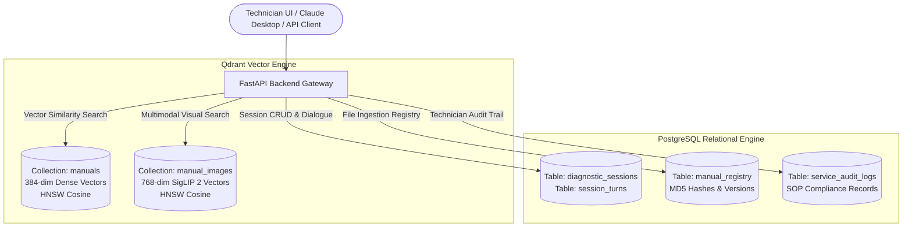
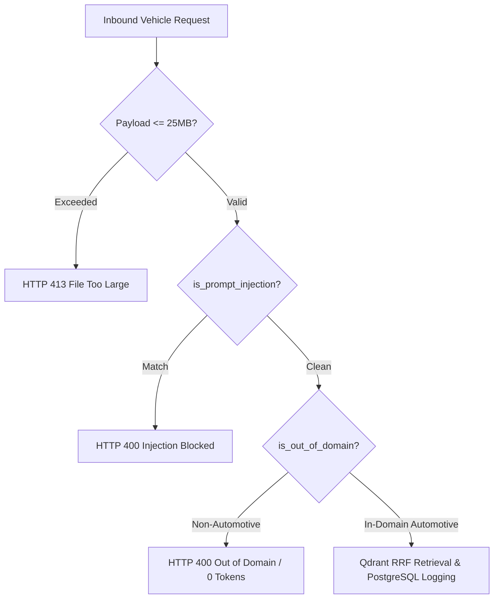
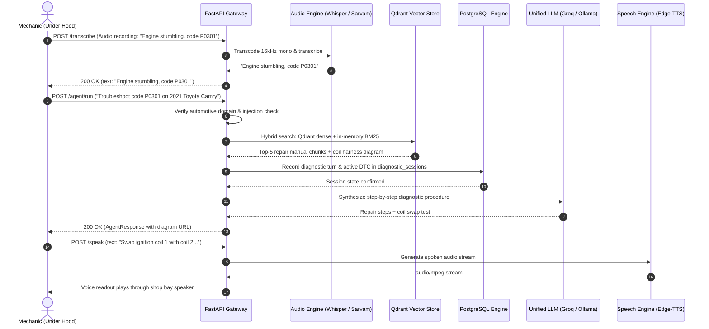

# OCTO-AUTO RAG: Multimodal Automotive Diagnostic Assistant & MCP Server — API Documentation

Comprehensive, authoritative technical reference for the **OCTO-AUTO RAG** REST API gateway and native **Model Context Protocol (MCP)** vehicle diagnostic server, powered by a **Dual-Database Architecture: Qdrant Vector Database + PostgreSQL Relational Engine**.

---

## Table of Contents

1. [API Overview](#1-api-overview)
2. [Base URL & Server Configuration](#2-base-url--server-configuration)
3. [Dual-Database Architecture (Qdrant + PostgreSQL)](#3-dual-database-architecture-qdrant--postgresql)
   - [Qdrant: Dedicated Vector Database](#qdrant-dedicated-vector-database)
   - [PostgreSQL: Relational Store, Sessions & Audit](#postgresql-relational-store-sessions--audit)
   - [Data Synchronization & Lifecycle](#data-synchronization--lifecycle)
4. [API Conventions & Protocols](#4-api-conventions--protocols)
5. [Endpoint Reference Matrix](#5-endpoint-reference-matrix)
6. [Chat & Streaming APIs](#6-chat--streaming-apis)
   - [POST /chat](#post-chat)
   - [POST /chat/stream](#post-chatstream)
7. [Vehicle Manual Ingestion & Asset Management](#7-vehicle-manual-ingestion--asset-management)
   - [POST /upload](#post-upload)
   - [GET /files](#get-files)
   - [DELETE /files/{filename}](#delete-filesfilename)
   - [POST /admin/reset](#post-adminreset)
   - [GET /vehicles](#get-vehicles)
   - [GET /debug_qdrant](#get-debug_qdrant)
8. [Automotive Agent Execution API](#8-automotive-agent-execution-api)
   - [POST /agent/run](#post-agentrun)
9. [OBD-II Guided Troubleshooting & Sessions](#9-obd-ii-guided-troubleshooting--sessions)
   - [POST /troubleshoot](#post-troubleshoot)
   - [GET /sessions](#get-sessions)
   - [POST /sessions](#post-sessions)
   - [GET /sessions/{session_id}](#get-sessionssession_id)
   - [DELETE /sessions/{session_id}](#delete-sessionssession_id)
10. [Voice & Speech APIs (Hands-Free Shop Floor)](#10-voice--speech-apis-hands-free-shop-floor)
    - [POST /transcribe](#post-transcribe)
    - [POST /speak](#post-speak)
11. [Automotive Schematic & Image Asset API](#11-automotive-schematic--image-asset-api)
    - [GET /document-images/{document_id}/{image_id}](#get-document-imagesdocument_idimage_id)
12. [System Telemetry & Health Checks](#12-system-telemetry--health-checks)
    - [GET /health](#get-health)
    - [GET /health/llm](#get-healthllm)
13. [Model Context Protocol (MCP) Integration](#13-model-context-protocol-mcp-integration)
    - [Architecture & Protocol Mount](#architecture--protocol-mount)
    - [Tool 1: search_fridge_manuals](#tool-1-search_fridge_manuals)
    - [Tool 2: lookup_error_code](#tool-2-lookup_error_code)
    - [Tool 3: get_thermistor_ohm_table](#tool-3-get_thermistor_ohm_table)
    - [Tool 4: lookup_part_number](#tool-4-lookup_part_number)
    - [Tool 5: run_octo_agent](#tool-5-run_octo_agent)
    - [Tool 6: troubleshoot_appliance_turn](#tool-6-troubleshoot_appliance_turn)
    - [Tool 7: list_manuals (Files MCP)](#tool-7-list_manuals-files-mcp)
    - [Tool 8: upload_manual (Files MCP)](#tool-8-upload_manual-files-mcp)
    - [Tool 9: delete_manual (Files MCP)](#tool-9-delete_manual-files-mcp)
    - [Tool 10: get_manual_metadata (Files MCP)](#tool-10-get_manual_metadata-files-mcp)
14. [Audit Trail & Telemetry APIs](#14-audit-trail--telemetry-apis)
    - [GET /audit/turns](#get-auditturns)
15. [Security, Domain Boundaries & Rate Limiting](#15-security-domain-boundaries--rate-limiting)
16. [Error Handling & HTTP Status Codes](#16-error-handling--http-status-codes)
16. [End-to-End Automotive Workflows](#16-end-to-end-automotive-workflows)
17. [Verification & Testing Guide](#17-verification--testing-guide)
18. [Interactive API Explorers (Swagger & ReDoc)](#18-interactive-api-explorers-swagger--redoc)
19. [API Changelog](#19-api-changelog)

---

## 1. API Overview

**OCTO-AUTO RAG** is an enterprise-grade multimodal artificial intelligence platform, state-guided Standard Operating Procedure (SOP) diagnostic engine, and Model Context Protocol (MCP) server engineered for dealership service bays, commercial fleet facilities, and automotive field technicians.

The system unifies two specialized storage engines to solve complex operational challenges:
1. **Qdrant Vector Engine**: Ultra-low-latency high-dimensional vector search across dual collections (`manuals` for text, `manual_images` for electrical CAD schematics) with payload filtering.
2. **PostgreSQL Relational Engine**: ACID-compliant transactional persistence for workshop repair orders, multi-turn troubleshooting dialogue, diagnostic session states, audit logs, and file version registries.

Key Operational Capabilities:
- **Low MTTR Retrieval**: Sub-100ms retrieval of wiring harnesses, pinout schematics, and torque specifications from 500+ page OEM workshop manuals using hybrid Reciprocal Rank Fusion (RRF, $k=60$) combining Qdrant dense vectors with in-memory BM25 sparse scoring.
- **Cross-Modal Schematic Search**: Google SigLIP 2 vision embeddings indexed directly in Qdrant, retrieving visual circuit schematics and exploded views from text queries.
- **OBD-II Diagnostic Engine**: Automated lookup and structured guided workflows for standard SAE/ISO Diagnostic Trouble Codes (`P0300`, `P0171`, `P0420`, `B1000`, `U0100`).
- **Hands-Free Shop Floor Ergonomics**: Voice STT (`faster-whisper` + Sarvam AI) and synthesized speech readouts (`edge-tts`), enabling hands-free operation while technicians hold multimeter probes.
- **Pre-LLM Security Perimeter**: Domain boundary filters intercept non-automotive prompts before vector database or LLM invocation, consuming **0 LLM API tokens** on off-topic requests.

---

## 2. Base URL & Server Configuration

### Server Access Points

| Service / Interface | Base URL | Protocol | Purpose |
| :--- | :--- | :--- | :--- |
| **REST API Gateway** | `http://127.0.0.1:8000` | HTTP / HTTPS | FastAPI ASGI engine (`uvicorn app.main:app`) |
| **MCP SSE Service** | `http://127.0.0.1:8000/mcp/sse` | HTTP SSE | Model Context Protocol SSE stream |
| **Technician Console** | `http://localhost:3000` | HTTP | Next.js 14 Service Bay Web UI |
| **Qdrant Engine** | `http://localhost:6333` | HTTP / gRPC | Vector similarity search & collections |
| **PostgreSQL Engine** | `postgresql://localhost:5432/octo_auto` | TCP / asyncpg | Relational tables, sessions & audit history |

### Middleware & Lifecycle

- **Lifespan Warmup**: Pre-warms `SentenceTransformers` (`all-MiniLM-L6-v2`) and `SigLIP 2` embedding models on server startup to eliminate cold-start delay.
- **CORS Protection**: Configured via `CORSMiddleware` restricted to `http://localhost:3000`.
- **Authentication**: `Not specified in the current implementation`. Perimeter access is protected via SlowAPI IP rate limiting and local subnet isolation.

---

## 3. Dual-Database Architecture (Qdrant + PostgreSQL)

OCTO-AUTO RAG employs a clear separation of storage responsibilities: **Qdrant** is dedicated exclusively to high-dimensional similarity retrieval, while **PostgreSQL** guarantees transactional durability for business logic and session history.



### Qdrant: Dedicated Vector Database

- **Collection `manuals`**:
  - **Vector Dimension**: 384 (`all-MiniLM-L6-v2`).
  - **Metric**: Cosine similarity.
  - **HNSW Index Parameters**: `m=16`, `ef_construct=100`.
  - **Payload Schema**:
    ```json
    {
      "chunk_id": "uuid-str",
      "source_file": "Toyota_Camry_2021_Manual.pdf",
      "product": "Toyota Camry 2.5L",
      "page_number": 78,
      "section_header": "Ignition System Diagnosis",
      "content": "Text segment..."
    }
    ```
- **Collection `manual_images`**:
  - **Vector Dimension**: 768 (`google/siglip-base-patch16-224`).
  - **Metric**: Cosine similarity.
  - **Payload Schema**:
    ```json
    {
      "image_id": "camry_p78_coil_pinout",
      "document_id": "Toyota_Camry_2021_Manual",
      "page_number": 78,
      "caption": "Ignition Coil Harness Pinout Diagram",
      "image_path": "images/Toyota_Camry_2021_Manual/p78_img1.png"
    }
    ```

---

### PostgreSQL: Relational Store, Sessions & Audit

```sql
-- Relational Schema in PostgreSQL
CREATE TABLE manual_registry (
    id SERIAL PRIMARY KEY,
    filename VARCHAR(255) UNIQUE NOT NULL,
    vehicle_make VARCHAR(100),
    vehicle_model VARCHAR(100),
    model_year INT,
    file_hash VARCHAR(64) NOT NULL,
    chunks_count INT DEFAULT 0,
    created_at TIMESTAMP WITH TIME ZONE DEFAULT CURRENT_TIMESTAMP
);

CREATE TABLE diagnostic_sessions (
    session_id VARCHAR(100) PRIMARY KEY,
    user_id VARCHAR(100) DEFAULT 'default_user',
    vehicle_model VARCHAR(100),
    current_dtc VARCHAR(20),
    status VARCHAR(50) DEFAULT 'START',
    step_number INT DEFAULT 0,
    created_at TIMESTAMP WITH TIME ZONE DEFAULT CURRENT_TIMESTAMP,
    updated_at TIMESTAMP WITH TIME ZONE DEFAULT CURRENT_TIMESTAMP
);

CREATE TABLE session_turns (
    id SERIAL PRIMARY KEY,
    session_id VARCHAR(100) REFERENCES diagnostic_sessions(session_id) ON DELETE CASCADE,
    sender VARCHAR(20) NOT NULL, -- 'user' or 'assistant'
    message_text TEXT NOT NULL,
    question TEXT,
    action TEXT,
    created_at TIMESTAMP WITH TIME ZONE DEFAULT CURRENT_TIMESTAMP
);
```

---

### Data Synchronization & Lifecycle

1. **Ingestion**: Uploaded manuals are recorded in PostgreSQL `manual_registry` with their MD5 hash. Chunk text vectors and extracted schematic visual vectors are written into Qdrant collections.
2. **Retrieval**: Queries perform 3-level waterfall vector similarity search in Qdrant, fused with in-memory BM25 scoring via Reciprocal Rank Fusion ($k=60$).
3. **Session State**: Multi-turn troubleshooting states and technician measurements (`Yes`/`No` actions, multimeter readings) are saved to PostgreSQL `diagnostic_sessions`.
4. **Deletion**: Deleting a manual removes its registration in PostgreSQL and purges its vector points in Qdrant by `source_file` filter atomically.

---

## 4. API Conventions & Protocols

- **Content-Type**:
  - `application/json; charset=utf-8` for REST endpoints.
  - `multipart/form-data` for manual uploads and audio files.
  - `text/event-stream` for live Server-Sent Events (SSE).
  - `audio/mpeg` or `audio/wav` for synthesized spoken instructions.
- **Rate Limit Headers**: Managed via `slowapi` (`X-RateLimit-Limit`, `X-RateLimit-Remaining`, `X-RateLimit-Reset`). Exceeded limits return `429 Too Many Requests`.
- **Automotive Domain Boundary**: Queries to `/chat`, `/chat/stream`, `/troubleshoot`, and `/agent/run` must relate to vehicles, OBD-II DTC codes, or workshop procedures. Non-automotive queries are blocked with `400 Bad Request` prior to database queries or LLM calls.

---

## 5. Endpoint Reference Matrix

| Method | Endpoint Path | Primary Purpose | Primary Store | Rate Limit |
| :--- | :--- | :--- | :--- | :--- |
| `GET` | `/health` | API status, LLM active provider, vector count | Qdrant + PG | None |
| `GET` | `/health/llm` | Telemetry on Ollama models and cloud fallback | LLM Provider | None |
| `GET` | `/files` | List all indexed OEM vehicle service manuals | PostgreSQL | None |
| `DELETE` | `/files/{filename}` | Atomic delete of manual, vectors & images | Qdrant + PG | None |
| `POST` | `/admin/reset` | Purge all Qdrant vectors, PG sessions & files | Qdrant + PG | None |
| `GET` | `/vehicles` | List all unique vehicle models in database | PostgreSQL | None |
| `GET` | `/debug_qdrant` | Vector distribution by document in Qdrant | Qdrant | None |
| `POST` | `/chat` | Standard multi-turn automotive RAG chat | Qdrant + PG | `20/minute` |
| `POST` | `/chat/stream` | Token-streaming SSE endpoint for chat | Qdrant | `30/minute` |
| `POST` | `/upload` | Parse, chunk, embed & index manual | Qdrant + PG | `60/minute` |
| `POST` | `/transcribe` | Transcribe mechanic's audio to text | Speech Engine | `60/minute` |
| `GET` | `/document-images/{doc_id}/{img_id}`| Stream extracted wiring schematic image | File Storage | `60/minute` |
| `POST` | `/speak` | Synthesize diagnostic text to spoken audio | Speech Engine | `20/minute` |
| `POST` | `/troubleshoot` | Multi-turn state-guided OBD-II diagnosis | PostgreSQL | `20/minute` |
| `POST` | `/agent/run` | Autonomous LangGraph diagnostic agent | Qdrant + PG | `10/minute` |
| `GET` | `/sessions` | List active repair sessions by technician | PostgreSQL | None |
| `GET` | `/sessions/{session_id}` | Retrieve full repair history & measurements| PostgreSQL | None |
| `POST` | `/sessions` | Save or update repair session in PostgreSQL | PostgreSQL | None |
| `DELETE` | `/sessions/{session_id}` | Delete repair session record | PostgreSQL | None |
| `GET` | `/mcp/sse` | FastMCP diagnostic server stream | MCP Server | None |

---

## 6. Chat & Streaming APIs

### POST /chat

Primary grounded question-answering endpoint. Performs automotive entity recognition, checks domain guardrails, executes 3-level waterfall search over Qdrant (`Exact Model` $\rightarrow$ `Platform Family` $\rightarrow$ `Global Manuals`), fuses dense embeddings with in-memory BM25 keyword scoring, logs session turn to PostgreSQL, and returns grounded answers with exact manual citations.

- **HTTP Method**: `POST`
- **Path**: `/chat`
- **Rate Limit**: `20/minute`
- **Headers**: `Content-Type: application/json`

#### Request Parameters (`ChatRequest`)

| Field | Type | Required | Constraints | Description |
| :--- | :--- | :--- | :--- | :--- |
| `message` | `string` | **Yes** | 1 to 4000 chars | Mechanic's inquiry, DTC code, or symptom. |
| `source_file` | `string` | No | Default: `None` | Restrict search to specific manual (e.g. `Ford_F150_2022_Manual.pdf`). |
| `session_id` | `string` | No | Default: `None` | UUID for conversation and clarification tracking. |

#### Request Example

```json
{
  "message": "What is the cylinder head bolt torque specification and tightening sequence?",
  "source_file": "Toyota_Camry_2.5L_2021_Service_Manual.pdf",
  "session_id": "bay-4-workorder-8812"
}
```

#### Response Example (200 OK — `ChatResponse`)

```json
{
  "answer": "For the **Toyota 2.5L A25A-FKS engine**, tighten cylinder head bolts in three progressive stages following the crisscross sequence from center outward:\n1. **Step 1**: Torque all bolts to **36 lb-ft (49 N·m)**.\n2. **Step 2**: Mark bolt heads and turn each bolt **90 degrees clockwise**.\n3. **Step 3**: Turn each bolt an additional **90 degrees clockwise** (180 degrees total rotation). Replace bolts if permanently stretched.",
  "sources": [
    "Toyota_Camry_2.5L_2021_Service_Manual.pdf"
  ],
  "needs_clarification": false,
  "clarification_question": null
}
```

---

### POST /chat/stream

Low Time-to-First-Token (TTFT) streaming endpoint utilizing Server-Sent Events (SSE) to deliver generated responses word-by-word.

- **HTTP Method**: `POST`
- **Path**: `/chat/stream`
- **Rate Limit**: `30/minute`
- **Headers**:
  - `Content-Type: application/json`
  - `Accept: text/event-stream`

#### Stream Event Output

```text
data: The
data:  cylinder
data:  head
data:  torque
data:  is
data:  **36 lb-ft**
data:  plus
data:  180
data:  degrees.
data: [DONE]
```

---

## 7. Vehicle Manual Ingestion & Asset Management

### POST /upload

Ingests, converts, chunks, embeds, and stores vehicle workshop documentation across storage engines:
1. Validates file size ($\le 25\text{MB}$) and MIME whitelist.
2. Checks MD5 checksum in PostgreSQL `manual_registry` to skip duplicate files.
3. Microsoft **MarkItDown** renders document into clean Markdown text.
4. **PyMuPDF** renders vector CAD diagrams and wiring schematics.
5. Generates 384-dim text vectors $\rightarrow$ stored in Qdrant collection `manuals`.
6. Generates 768-dim SigLIP 2 visual vectors $\rightarrow$ stored in Qdrant collection `manual_images`.
7. Records document metadata and chunk count in PostgreSQL `manual_registry`.

- **HTTP Method**: `POST`
- **Path**: `/upload`
- **Rate Limit**: `60/minute`
- **Content-Type**: `multipart/form-data`

#### Allowed File Types
- `.pdf`, `.docx`, `.ppt`, `.pptx`, `.xls`, `.xlsx`, `.txt`

#### Response Example (200 OK — `UploadResponse`)

```json
{
  "filename": "Ford_F150_2022_Manual.pdf",
  "markdown_file": "Ford_F150_2022_Manual.md",
  "chunks_ingested": 142,
  "status": "processed"
}
```

---

### GET /files

Queries PostgreSQL `manual_registry` and local disk to return an alphabetical list of all ingested vehicle service manuals.

- **HTTP Method**: `GET`
- **Path**: `/files`
- **Response (200 OK)**:
  ```json
  {
    "files": [
      "Ford_F150_2022_Manual.pdf",
      "Honda_Civic_2020_Powertrain_Manual.pdf",
      "Toyota_Camry_2.5L_2021_Service_Manual.pdf"
    ]
  }
  ```

---

### DELETE /files/{filename}

Atomic complete purge of an automotive manual across all systems:
1. Deletes raw file and processed markdown from local disk.
2. Deletes text vector points in Qdrant collection `manuals` matching `source_file`.
3. Deletes schematic vision points in Qdrant collection `manual_images`.
4. Deletes entry from PostgreSQL `manual_registry`.
5. Clears in-memory LRU retrieval cache.

- **HTTP Method**: `DELETE`
- **Path**: `/files/{filename}`
- **Response (200 OK)**:
  ```json
  {
    "status": "deleted",
    "filename": "Ford_F150_2022_Manual.pdf"
  }
  ```

---

### POST /admin/reset

Completely wipes all manuals from disk, purges both Qdrant collections (`manuals` and `manual_images`), and truncates PostgreSQL tables (`manual_registry`, `diagnostic_sessions`, `session_turns`).

- **HTTP Method**: `POST`
- **Path**: `/admin/reset`
- **Response (200 OK)**:
  ```json
  {
    "status": "ok",
    "message": "All manuals and index data successfully wiped."
  }
  ```

---

### GET /vehicles

Queries Qdrant vector payloads and PostgreSQL metadata for all unique vehicle makes and models.

- **HTTP Method**: `GET`
- **Path**: `/vehicles`
- **Response (200 OK)**:
  ```json
  {
    "vehicles": [
      "Ford F-150 3.5L EcoBoost",
      "Honda Civic 2.0L",
      "Toyota Camry 2.5L"
    ]
  }
  ```

---

### GET /debug_qdrant

Inspects vector density and point counts per manual directly inside Qdrant.

- **HTTP Method**: `GET`
- **Path**: `/debug_qdrant`
- **Response (200 OK)**:
  ```json
  {
    "total": 560,
    "sources_count": {
      "Ford_F150_2022_Manual.pdf": 218,
      "Toyota_Camry_2.5L_2021_Service_Manual.pdf": 342
    }
  }
  ```

---

## 8. Automotive Agent Execution API

### POST /agent/run

Executes the autonomous **LangGraph `StateGraph`** agentic workflow for vehicle troubleshooting. Resolves vehicle identifiers, checks version records, queries Qdrant hybrid vectors, records session turns in PostgreSQL, and delivers structured repair steps with wiring schematics.

- **HTTP Method**: `POST`
- **Path**: `/agent/run`
- **Rate Limit**: `10/minute`
- **Headers**: `Content-Type: application/json`

#### Request Example (`AgentRequest`)

```json
{
  "query": "Troubleshoot diagnostic trouble code P0301 on 2021 Toyota Camry",
  "source_input": "Toyota_Camry_2.5L_2021_Service_Manual.pdf",
  "session_id": "bay-2-agent-session",
  "language": "auto"
}
```

- `language` (`string`, optional, default `"auto"`): Language code hint for response generation (`"auto"`, `"ta"` for Tamil, `"hi"` for Hindi, `"en"` for English). If `"auto"`, the engine automatically detects script Unicode ranges (`\u0b80-\u0bff` for Tamil, `\u0900-\u097f` for Hindi).

#### Response Example (200 OK — `AgentResponse`)

```json
{
  "answer": "Code **P0301** indicates a detected cylinder 1 misfire. Common causes include a defective ignition coil, fouled spark plug, or clogged fuel injector. Swap the Cylinder 1 ignition coil with Cylinder 2 to check if the misfire migrates.",
  "steps": [
    "Disconnect negative 12V battery terminal",
    "Remove engine beauty cover to access coil-on-plug packs",
    "Disconnect Cylinder 1 coil harness connector (Grey 4-pin)",
    "Remove 10mm retaining bolt and pull ignition coil",
    "Inspect spark plug tube for engine oil ingress"
  ],
  "sources": [
    {
      "source": "Toyota_Camry_2.5L_2021_Service_Manual.pdf",
      "page": 78,
      "rrf_score": 0.0412
    }
  ],
  "product_id": "Toyota Camry 2.5L",
  "clarification_needed": false,
  "clarification_question": null,
  "status": "troubleshoot",
  "version_info": null,
  "images": [
    {
      "image_id": "camry_p78_ignition_layout",
      "document_id": "Toyota_Camry_2.5L_2021_Service_Manual",
      "page": 78,
      "caption": "Ignition Coil Harness Pinout and Cylinder Bank Identification",
      "image_url": "/document-images/Toyota_Camry_2.5L_2021_Service_Manual/camry_p78_ignition_layout"
    }
  ]
}
```

---

## 9. OBD-II Guided Troubleshooting & Sessions

### POST /troubleshoot

Interactive state machine executing bounded diagnostic workflows:
$$\text{START} \longrightarrow \text{IDENTIFY\_VEHICLE} \longrightarrow \text{RETRIEVE\_KNOWLEDGE} \longrightarrow \text{DIAGNOSE} \longrightarrow \text{QUESTION} \longrightarrow \text{ACTION} \longrightarrow \text{VERIFY} \longrightarrow \text{RESOLVED / ESCALATE}$$

Every state transition and technician response is persisted directly into PostgreSQL `diagnostic_sessions` and `session_turns`.

- **HTTP Method**: `POST`
- **Path**: `/troubleshoot`
- **Rate Limit**: `20/minute`

#### Request Example (`TroubleshootRequest`)

```json
{
  "session_id": "workorder-9901",
  "message": "Engine runs rough at idle, check engine light flashing, code P0300 present"
}
```

#### Response Example (Action State — 200 OK)

```json
{
  "status": "action",
  "action": "Connect fuel pressure gauge to the test port on the fuel rail. Key ON, engine OFF: fuel pressure must hold between 55 to 60 PSI. If pressure drops immediately below 40 PSI, inspect the fuel pressure regulator and check valve.",
  "session": {
    "session_id": "workorder-9901",
    "product": "Ford F-150 3.5L EcoBoost",
    "issue": "P0300 random misfire",
    "step": 2,
    "status": "ACTION",
    "history": [
      {
        "question": "Is the misfire isolated to a single cylinder or multiple cylinders?",
        "answer": "Scan tool shows random misfires across cylinders 1, 3, and 5."
      }
    ]
  }
}
```

---

### Session Management Endpoints (PostgreSQL Persisted)

- `GET /sessions?user_id=tech_mike`: Lists all repair order sessions stored in PostgreSQL.
- `GET /sessions/{session_id}`: Retrieves complete multi-turn diagnostic dialogue and technician measurements.
- `POST /sessions`: Persists or updates session records in PostgreSQL `diagnostic_sessions`.
- `DELETE /sessions/{session_id}`: Clears a completed work order session from PostgreSQL.

---

## 10. Voice & Speech APIs (Hands-Free Shop Floor)

### POST /transcribe

Converts technician speech into text using local `faster-whisper` (`int8` CPU) for English, or **Sarvam AI (`Saaras v3`)** for regional dialects.

- **HTTP Method**: `POST`
- **Path**: `/transcribe`
- **Rate Limit**: `60/minute`
- **Content-Type**: `multipart/form-data`
- **Fields**: `audio` (`UploadFile`), `hint_lang` (`string`, default `"auto"`).

#### Response (200 OK)

```json
{
  "text": "The oxygen sensor bank 1 sensor 1 voltage is stuck at 0.1 volts lean.",
  "detected_language": "en"
}
```

---

### POST /speak

Synthesizes diagnostic instructions into spoken audio using Microsoft **Edge-TTS** or **Sarvam AI (`Bulbul v3`)**, stripping technical markdown syntax for clear speech delivery.

- **HTTP Method**: `POST`
- **Path**: `/speak`
- **Rate Limit**: `20/minute`
- **Payload (`SpeakRequest`)**:
  ```json
  {
    "text": "Measure voltage across the MAF sensor connector pins 2 and 3 with ignition ON.",
    "language": "en"
  }
  ```
- **Response**: Binary audio stream (`audio/mpeg` or `audio/wav`).

---

## 11. Automotive Schematic & Image Asset API

### GET /document-images/{document_id}/{image_id}

Securely streams wiring diagrams, ECU pinout maps, and exploded component illustrations.

- **HTTP Method**: `GET`
- **Path**: `/document-images/{document_id}/{image_id}`
- **Rate Limit**: `60/minute`
- **Security Validation**:
  - `document_id` and `image_id` must match `^[a-zA-Z0-9_-]+$`.
  - Canonical path prefix verified to prevent directory traversal.
  - Image record must exist in Qdrant / filesystem metadata.
- **Response**: `FileResponse` (`image/png` or `image/jpeg`).

---

## 12. System Telemetry & Health Checks

### GET /health

Returns service status and vector points stored in Qdrant.

- **HTTP Method**: `GET`
- **Path**: `/health`
- **Response (200 OK — `HealthResponse`)**:
  ```json
  {
    "status": "ok",
    "llm_provider": "groq",
    "vectors_stored": 560
  }
  ```

---

### GET /health/llm

Telemetry on local Ollama models (`qwen2.5:3b`, `gemma3:4b`, `llama3.2:3b`), Qdrant vector connectivity, PostgreSQL session store health, and active cloud fallback models (Groq `qwen/qwen3.8-27b`, SambaNova).

- **HTTP Method**: `GET`
- **Path**: `/health/llm`
- **Response (200 OK)**:
  ```json
  {
    "status": "ok",
    "primary_provider": "ollama",
    "ollama_enabled": false,
    "ollama_base_url": "http://127.0.0.1:11434",
    "vector_store": "qdrant",
    "relational_store": "postgresql",
    "cloud_fallback_provider": "groq",
    "cloud_fallback_model": "qwen/qwen3.8-27b",
    "last_provider_used": "groq",
    "last_model_used": "qwen/qwen3.8-27b",
    "stats": {
      "total_requests": 28,
      "cloud_fallback_served": 28
    }
  }
  ```

---

## 13. Model Context Protocol (MCP) Integration

### Architecture & Protocol Mount

OCTO-AUTO RAG mounts a native FastMCP Server exposing **6 automotive diagnostic tools** over Server-Sent Events at `GET /mcp/sse` and Standard I/O (stdio).

#### Claude Desktop Configuration (`claude_desktop_config.json`)

```json
{
  "mcpServers": {
    "octo-auto": {
      "command": "python",
      "args": [
        "C:\\Users\\SAMSUNG\\OneDrive\\Desktop\\rag-multimodal-assistant\\backend\\app\\mcp\\auto_mcp_server.py"
      ]
    }
  }
}
```

---

### Tool 1: search_vehicle_manuals

Searches Qdrant vector database for torque values, wiring diagrams, and fluid capacities from OEM service manuals.

- **Parameters**:
  - `query` (`string`, required): Diagnostic or procedure inquiry.
  - `source_file` (`string`, optional): Restrict search to specific vehicle manual.
- **Output**: Formatted chunks with page and manual citations.

---

### Tool 2: lookup_obd_error_code

Resolves standard SAE/ISO OBD-II Diagnostic Trouble Codes (DTCs).

- **Parameters**:
  - `make` (`string`, required): Vehicle manufacturer (e.g. `Ford`, `Toyota`, `Honda`, `General Motors`).
  - `model` (`string`, required): Vehicle model/engine (e.g. `F-150 3.5L`, `Camry 2.5L`).
  - `code` (`string`, required): OBD-II code (e.g. `P0300`, `P0171`, `P0420`, `B1000`, `U0100`).

#### Output Example

```json
{
  "make": "Ford",
  "model": "F-150",
  "code": "P0171",
  "status": "FOUND",
  "system": "Fuel Trim System Lean (Bank 1)",
  "test_procedure": "Monitor Long Term Fuel Trim (LTFT) with scan tool. Spray carb cleaner around intake manifold gaskets and PCV hose while observing short-term trim for sudden drop. Smoke test intake tract.",
  "recommended_action": "Inspect MAF sensor element for oil contamination. Replace cracked PCV vacuum lines or intake plenum gaskets."
}
```

---

### Tool 3: get_ect_sensor_ohm_table

Calculates expected NTC thermistor resistance (k$\Omega$) for Engine Coolant Temperature (ECT) and Intake Air Temperature (IAT) sensors using the Steinhart-Hart equation.

- **Parameters**:
  - `temp_celsius` (`float`, required): Coolant test temperature in °C.
- **Output Example**:
  ```json
  {
    "temperature_celsius": 20.0,
    "temperature_fahrenheit": 68.0,
    "expected_resistance_kohm": 2.45,
    "multimeter_setting": "20kOhm Resistance",
    "testing_instruction": "Connect multimeter probes across ECT sensor terminals. At 20°C (68°F), meter should read ~2.45 kOhm. Resistance must drop smoothly as engine warms to 90°C (~250 Ohm). Infinite reading indicates open sensor.",
    "status": "OK"
  }
  ```

---

### Tool 4: lookup_oem_part_number

Resolves OEM replacement parts, part numbers, and replacement difficulty.

- **Parameters**:
  - `model` (`string`, required): Vehicle model (e.g. `Ford F-150`).
  - `component_name` (`string`, required): Part description (e.g. `spark plug`, `alternator`, `brake rotor`, `fuel pump`, `oxygen sensor`).

#### Output Example

```json
{
  "searched_model": "Ford F-150",
  "searched_component": "spark plug",
  "oem_part_number": "SP-550 / CYFS-12F-P",
  "official_name": "Motorcraft Iridium Spark Plug (Pre-gapped 0.030\")",
  "electrical_specs": "Thread 14mm, Hex 5/8\", Torque 133 lb-in (15 N·m)",
  "repair_difficulty": "Moderate",
  "status": "MATCH_FOUND"
}
```

---

### Tool 5: run_octo_agent

Executes full LangGraph autonomous troubleshooting flow from external MCP clients (Claude Desktop / IDEs).

- **Parameters**: `query` (`string`), `source_input` (`string`, optional), `session_id` (`string`, optional).
- **Output**: Structured `AgentResponse` dictionary with steps, sources, and schematic image URLs.

---

### Tool 6: troubleshoot_appliance_turn

Drives interactive multi-turn diagnostic flows from within MCP tools, updating PostgreSQL session state.

- **Parameters**: `session_id` (`string`), `message` (`string`).
- **Output**: Diagnostic state machine payload (`status`, `question`/`action`, `session`).

---

### Tool 7: list_manuals (Files MCP)

Lists all technical manuals indexed across the hybrid system, querying the PostgreSQL `manual_registry` and comparing against Qdrant vector sources.

- **Parameters**: None.
- **Output Example**:
  ```json
  {
    "status": "success",
    "count": 8,
    "manuals": [
      {
        "id": 1,
        "filename": "GE_Profile_Fridge.pdf",
        "file_hash": "a1b2c3d4e5f6...",
        "file_size_bytes": 1048576,
        "chunks_count": 28,
        "equipment_type": "appliance",
        "model": "GE Profile",
        "uploaded_at": "2026-09-25T16:47:00Z",
        "is_active": true
      }
    ],
    "vector_sources": ["GE_Profile_Fridge.pdf", "Toyota_Camry_Manual.pdf"]
  }
  ```

---

### Tool 8: upload_manual (Files MCP)

Uploads and registers a new equipment manual document via MCP protocol without touching HTTP endpoints.
1. Decodes binary base64 file content.
2. Checks MD5 hash duplicate in PostgreSQL (skips re-indexing if unchanged).
3. Parses text and figures using MarkItDown and PyMuPDF.
4. Chunks text and embeds vectors into Qdrant `manuals` collection.
5. Inserts metadata record into PostgreSQL `manual_registry`.

- **Parameters**:
  - `filename` (`string`, required): Name of the file (e.g. `Haas_CNC_VF2.pdf`).
  - `content_base64` (`string`, required): Base64-encoded file bytes.
  - `equipment_type` (`string`, optional, default `"industrial"`): Equipment category (`"industrial"`, `"automobile"`, `"appliance"`).
  - `model` (`string`, optional): Equipment model identifier.
- **Output Example**:
  ```json
  {
    "status": "processed",
    "filename": "Haas_CNC_VF2.pdf",
    "markdown_file": "output/Haas_CNC_VF2.md",
    "chunks_ingested": 42,
    "equipment_type": "industrial",
    "registered_record": { "id": 9, "filename": "Haas_CNC_VF2.pdf" }
  }
  ```

---

### Tool 9: delete_manual (Files MCP)

Atomically purges an equipment manual from the entire knowledge infrastructure:
1. Deletes raw document from storage.
2. Deletes parsed markdown and figure image directories.
3. Purges text chunks from Qdrant `manuals` collection.
4. Purges image vectors from Qdrant `manual_images` collection.
5. Removes record from PostgreSQL `manual_registry`.
6. Flushes retrieval LRU cache.

- **Parameters**:
  - `filename` (`string`, required): Name of manual to purge.
- **Output Example**:
  ```json
  {
    "status": "deleted",
    "filename": "Haas_CNC_VF2.pdf",
    "postgres_record_removed": true
  }
  ```

---

### Tool 10: get_manual_metadata (Files MCP)

Inspects indexing telemetry, chunk count, file size, MD5 hash, and vector health for a specified manual.

- **Parameters**:
  - `filename` (`string`, required): Name of manual to inspect.
- **Output Example**:
  ```json
  {
    "status": "success",
    "filename": "GE_Profile_Fridge.pdf",
    "found": true,
    "in_vector_store": true,
    "metadata": {
      "filename": "GE_Profile_Fridge.pdf",
      "chunks_count": 28,
      "equipment_type": "appliance",
      "file_hash": "a1b2c3d4e5f6..."
    }
  }
  ```

---

## 14. Audit Trail & Telemetry APIs

### GET /audit/turns

Retrieves chronologically ordered technician diagnostic turn logs from PostgreSQL `session_turns` for compliance and procedure adherence audits.

- **HTTP Method**: `GET`
- **Path**: `/audit/turns`
- **Query Parameters**:
  - `limit` (`integer`, optional, default `50`): Maximum records to retrieve.
- **Response (200 OK)**:
  ```json
  {
    "status": "ok",
    "count": 14,
    "turns": [
      {
        "id": 1,
        "session_id": "3fa85f64-5717-4562-b3fc-2c963f66afa6",
        "turn_index": 1,
        "user_input": "ஃப்ரீஸர் பத்தி சொல்லு",
        "system_response": "ஃப்ரீஸர் பகுதி 0 டிகிரி ஃபாரன்ஹைட் (-18 C) வெப்பநிலையைப் பராமரிக்கிறது...",
        "detected_language": "ta",
        "retrieval_confidence": "HIGH",
        "context_citations": ["GE_Profile_Fridge.pdf#p14"],
        "created_at": "2026-09-25T16:48:30Z"
      }
    ]
  }
  ```

---

## 15. Security, Domain Boundaries & Rate Limiting

### Pre-LLM Perimeter Protection



### Automotive Domain Guardrails (`prompt_guard.py`)
- **In-Domain Terms Allowed**: Engine, transmission, brake, suspension, chassis, ECU, PCM, alternator, starter, spark plug, fuel injector, OBD-II, DTC, turbocharger, differential, cooling system, radiator, coolant, oil, battery, sensor, catalytic converter, exhaust.
- **Out-of-Domain Blocked**: Cooking recipes, household appliances, real estate, politics, cryptocurrencies, poems, creative fiction.
- **Economic Value**: Guarantees **0 LLM API tokens** are consumed on irrelevant or malicious traffic.

---

## 15. Error Handling & HTTP Status Codes

| Status Code | Trigger Condition | Detail Message |
| :--- | :--- | :--- |
| **`200 OK`** | Request executed successfully | Returned with schema payload |
| **`400 Bad Request`** | Prompt injection pattern detected | `"Potential prompt injection detected."` |
| **`400 Bad Request`** | Non-automotive query submitted | `"Specialized strictly in vehicle technical diagnostics..."` |
| **`400 Bad Request`** | Unsupported manual file format | `"Unsupported format. Supported: .pdf, .docx, .txt, .xlsx"` |
| **`404 Not Found`** | Missing session ID or schematic asset | `"Session not found"` or `"Not found"` |
| **`413 Too Large`** | Manual file exceeds 25MB | `"File is too large. Max size allowed is 25MB."` |
| **`429 Rate Limit`** | Inbound requests exceed `slowapi` cap | `"Rate limit exceeded: 20 per 1 minute"` |
| **`500 Server Error`** | Unhandled database or model exception | `"LLM call failed: ..."` |
| **`503 Unavailable`** | All local and cloud LLM providers down | `"No LLM provider available..."` |

---

## 16. End-to-End Automotive Workflows

### Workflow 1: Technician Hands-Free Misfire Diagnosis (Dual-DB)



---

## 17. Verification & Testing Guide

### 1. Test Qdrant & PostgreSQL Health via cURL

```bash
# Check basic API status, LLM engine, and Qdrant vector point count
curl -X GET "http://127.0.0.1:8000/health"

# Detailed telemetry (LLM models, Qdrant & PostgreSQL health)
curl -X GET "http://127.0.0.1:8000/health/llm"
```

### 2. Query Automotive RAG Pipeline via Python

```python
import urllib.request
import json

payload = json.dumps({
    "message": "What is the firing order for the 3.5L EcoBoost engine?"
}).encode("utf-8")

req = urllib.request.Request(
    "http://127.0.0.1:8000/chat",
    data=payload,
    headers={"Content-Type": "application/json"},
    method="POST"
)

with urllib.request.urlopen(req) as resp:
    data = json.loads(resp.read().decode("utf-8"))
    print("Answer:\n", data["answer"])
    print("Sources:", data["sources"])
```

### 3. Run Automated Diagnostic Pytest Suite

```powershell
cd backend
python -m pytest tests -v
```

---

## 18. Interactive API Explorers (Swagger & ReDoc)

Interactive API explorers are automatically served by FastAPI:

- **Interactive Swagger UI**: [`http://127.0.0.1:8000/docs`](http://127.0.0.1:8000/docs)
  - Full interactive schema exploration, file upload sandbox, and endpoint execution.
- **ReDoc Technical Reference**: [`http://127.0.0.1:8000/redoc`](http://127.0.0.1:8000/redoc)
  - Responsive, three-panel technical documentation for enterprise integration.
- **Raw OpenAPI 3.1 JSON Schema**: [`http://127.0.0.1:8000/openapi.json`](http://127.0.0.1:8000/openapi.json)

---

## 19. API Changelog

### Version 3.1.0 (Dual-Database Automotive Edition)
- **Qdrant Vector Engine**: Dedicated dual-collection architecture for high-dimensional nearest neighbor search: `manuals` (384-dim text chunks) and `manual_images` (768-dim SigLIP 2 visual CAD & wiring diagrams) with payload filtering.
- **PostgreSQL Relational Engine**: Added PostgreSQL relational schema (`manual_registry`, `diagnostic_sessions`, `session_turns`) for multi-turn repair histories, technician audit trails, and version checksums.
- **Automotive Domain Specialization**: Re-anchored entity identification, prompt guardrails, and diagnostic workflows around light-duty and commercial automotive maintenance.
- **OBD-II & Sensor Diagnostics**: Added native FastMCP diagnostic tools for DTC resolution (`lookup_obd_error_code`), engine coolant temperature sensors (`get_ect_sensor_ohm_table`), and OEM parts lookup (`lookup_oem_part_number`).
- **Hands-Free Shop Ergonomics**: Integrated dual STT and neural TTS pipelines for seamless voice-driven service bay interaction.
- **Multi-Tier Fault Tolerance**: Added resilient cloud fallback across Groq (`qwen/qwen3.8-27b`) and SambaNova with automatic local Ollama model coordination.
