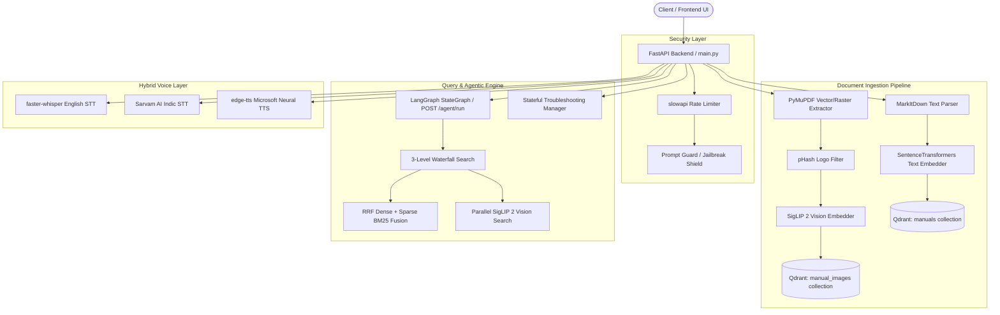

# OCTO-RAG: Multimodal RAG Assistant & Agentic Troubleshooting Engine

A production-ready **Multimodal Retrieval-Augmented Generation (RAG) Assistant** and **State-Guided Agentic Engine** designed to ingest technical manuals, render vector diagrams, perform context-aware hierarchical search, execute multi-turn diagnostic troubleshooting workflows, stream voice interaction, and enforce security policies.

---

## 🎯 Operational Problems Solved

This platform directly resolves high-impact enterprise, technical, and field-operation pain points:

* **⏱️ High Mean Time to Resolution (MTTR)**: Eliminates manual skimming through hundreds of pages of PDF/DOCX documentation by extracting grounded answers and step-by-step diagnostic sequences in seconds.
* **💸 Escalation Ticket Overload**: Serves as an automated Tier-1/Tier-2 support copilot. Its state-guided decision engine exhausts manual-backed diagnostic steps before triggering explicit human escalation (`ESCALATE`), reducing costly support ticket escalations.
* **🎓 Onboarding Friction for Junior Technicians**: Enables new support agents and field engineers to resolve complex technical queries instantly without memorizing extensive product catalogs.
* **🛑 Hands-Free Field Maintenance Constraints**: Provides a low-latency voice layer (STT + TTS) so technicians operating physical hardware can ask questions and hear audio instructions without stopping work to type.
* **🏢 Knowledge Silos & Product Line Confusion**: Automates zero-shot metadata extraction and 3-level priority filtering (Exact Product $\rightarrow$ Family Prefix $\rightarrow$ Global) to prevent agents from retrieving fixes intended for different hardware models.
* **📋 SOP Non-Compliance & Audit Blind Spots**: Logs complete diagnostic session histories in a structured registry, recording every question asked, user answer, recommended action, and manual chunk reference for auditability.
* **⚡ Redundant Ingestion Compute Overhead**: Uses SQLite MD5 content-hash caching to detect unchanged files or web pages, skipping redundant chunking, embedding, and vector DB indexing.
* **🛡️ Security & Prompt Injection Vulnerabilities**: Enforces multi-tier security including `slowapi` rate limiters, upload file size/MIME guards, regex prompt injection filters (`prompt_guard.py`), and context-isolated prompt construction.

---

## 🚀 Key Features

* **📄 Multimodal Document & Visual Ingestion**: Converts uploads (`PDF`, `DOCX`, `PPTX`, `XLSX`, `TXT`) into Markdown using **Microsoft MarkItDown**. Extracts raster images and renders high-resolution vector path diagrams via **PyMuPDF**, applying perceptual hashing (`pHash`) to drop repeated header/footer logos.
* **🖼️ SigLIP 2 Visual Semantic Search**: Generates 768-dim multimodal embeddings using **Google SigLIP 2** (`google/siglip-base-patch16-224`) stored in a dedicated `manual_images` Qdrant collection, running parallel text and visual image retrieval.
* **🔍 Hierarchical Hybrid Search (RRF)**: Executes a 3-level prioritized waterfall search (Exact Product $\rightarrow$ Product Family $\rightarrow$ Global Search) combining dense vectors (`SentenceTransformers all-MiniLM-L6-v2`) and in-memory sparse keyword matching (`BM25`) using **Reciprocal Rank Fusion (RRF)**:
  $$\text{RRF Score}(d) = \sum_{m \in M} \frac{1}{60 + r_m(d)}$$
* **🦜 Unified LangGraph Agentic Engine**: Orchestrates URL scraping (BeautifulSoup4), file version control, fuzzy product model matching, intent classification (`qa` vs `troubleshoot`), and step generation via a bounded **LangGraph `StateGraph`** (`POST /agent/run`).
* **🤖 Stateful Troubleshooting Orchestration**: Guides users through diagnostic trees tracking active state (`QUESTION`, `ACTION`, `VERIFY`, `RESOLVED`, `ESCALATE`), session history, and pinned RAG context blocks across user turns.
* **🎙️ Hybrid Voice Layer (STT & TTS)**: Transcribes incoming audio using local `faster-whisper` (`int8` CPU) for English or Sarvam AI (`Saaras v3 API`) for Indic/auto languages. Synthesizes speech outputs using **edge-tts** with Microsoft Neural voices.
* **⚡ Multi-Tier Caching Architecture**: Features in-memory LRU query retrieval caching (`_RETRIEVAL_CACHE`), LRU text vector embedding caching (`@lru_cache`), SQLite document content hash caching (`registry.db`), and pre-cached ML model weights.
* **🛡️ Hardened API Security**: Integrated `slowapi` rate limits across all routes, file upload guards ($\le 25\text{MB}$, MIME validation), regex jailbreak detection, and isolated system prompts.
* **🧪 34-Test Verification Suite**: Includes 34 passing unit, integration, vision, security, and performance test suites (`pytest`) running in isolated in-memory test environments.

---

## ⚡ Multi-Tier Caching Architecture

| Cache Layer | Storage Mechanism | Purpose | Benefit |
| :--- | :--- | :--- | :--- |
| **LRU Retrieval Cache** | In-memory Dict (`_RETRIEVAL_CACHE`, capacity=500) | Caches top RAG chunks by query key | Sub-5ms response time for repeated search queries |
| **LRU Embedding Cache** | `@lru_cache(maxsize=1024)` in `EmbedderService` | Caches text vector encodings | Eliminates duplicate embedding CPU computation |
| **SQLite Version Cache** | `registry.db` SQLite database table | Stores MD5 hashes of raw files & URLs | Skips re-chunking and re-embedding unchanged documents |
| **Session State Cache** | `SessionStore` (SQLite / In-memory) | Stores multi-turn diagnostic history & state | Preserves troubleshooting context across user turns |
| **ML Model Disk Cache** | Local Hugging Face Cache (`HF_HUB_OFFLINE=1`) | Stores local model weights on disk | Enables fast offline startup without downloading weights |

---

## 🛡️ Security & Rate Limiting Rules

All API routes are protected by **`slowapi` IP rate limiters**:

| Endpoint | Method | Rate Limit | Protection Scope |
| :--- | :--- | :--- | :--- |
| `/upload` | `POST` | `5 / minute` | CPU & storage protection against rapid file upload spam |
| `/agent/run` | `POST` | `10 / minute` | Limits complex LangGraph scraping and agent execution workflows |
| `/transcribe` | `POST` | `10 / minute` | Prevents STT audio processing queue saturation |
| `/chat` | `POST` | `20 / minute` | Rate limits standard RAG query generation |
| `/troubleshoot`| `POST` | `20 / minute` | Limits state-guided diagnostic turns |
| `/speak` | `POST` | `20 / minute` | Protects edge-tts text-to-speech generation |
| `/chat/stream` | `POST` | `30 / minute` | Controls Server-Sent Events (SSE) streaming connections |
| `/document-images/...` | `GET` | `60 / minute` | Prevents automated document image scraping |

---

## 🏗️ System Architecture Overview



For complete architectural details, module-by-module problem-solving breakdowns, and state transition flowcharts, see **[architecture.md](architecture.md)** and **[context.md](context.md)**.

---

## 📁 Project Structure

```text
rag-multimodal-assistant/
├── docker-compose.yml         # Container configuration for Backend + Frontend
├── architecture.md            # Complete architecture specs, sub-module breakdowns & flowcharts
├── context.md                 # Full project reference context, test suite matrix & benchmarks
├── contributing.md            # Onboarding & Local Setup guide
├── backend/
│   ├── Dockerfile             # Multi-stage Dockerfile with pre-cached model weights
│   ├── requirements.txt       # Hardened requirements (slowapi, pytest, bandit, etc.)
│   ├── .env.example           # Environment template file
│   └── app/
│       ├── main.py            # FastAPI entrypoint, routes & rate limiters
│       ├── config.py          # Unified Settings manager using pathlib.Path
│       └── services/
│           ├── parser.py      # MarkItDown parse & document ingestion engine
│           ├── image_extractor.py # PyMuPDF image & vector region extractor
│           ├── image_filters.py   # pHash & aspect ratio decorative image filters
│           ├── chunker.py     # Smart character overlapping chunker
│           ├── embedder.py    # SentenceTransformers singleton with LRU cache
│           ├── vision_embedder.py # SigLIP 2 multimodal vision embedder singleton
│           ├── vision_search.py   # SigLIP 2 image search service
│           ├── vector_store.py# Qdrant interface (manuals & manual_images dual collections)
│           ├── hybrid_search.py# In-memory BM25 sparse search and RRF fusion
│           ├── retriever.py   # 3-level waterfall hybrid search + parallel vision retrieval
│           ├── query_understanding.py # Query confidence analyzer & intent classifier
│           ├── context_reconstruction.py # Multi-turn query rewriter
│           ├── session_store.py   # SQLite multi-turn session state store
│           ├── prompt_guard.py    # Security regex injection guard
│           ├── agent_flow.py      # LangGraph unified agentic StateGraph
│           ├── workflow_manager.py# Multi-turn troubleshooting state machine
│           └── audio.py           # Speech Transcriber (Whisper/Sarvam) & TTS (edge-tts)
└── frontend/                  # Next.js UI application codebase
```

---

## ⚙️ Quickstart & Local Setup

### 1. Setup Environment
Create a `backend/.env` file from the example template:
```bash
cp backend/.env.example backend/.env
```
Configure your LLM provider and optional API keys:
```env
LLM_PROVIDER=groq
GROQ_API_KEY=your_groq_api_key
# Optional: SAMBANOVA_API_KEY=your_sambanova_key
# Optional: SARVAM_API_KEY=your_sarvam_key
```

### 2. Launch with Docker Compose
To build and run the entire ecosystem (FastAPI Backend + Next.js Frontend + pre-cached model weights) locally:
```bash
docker compose up --build
```

### 3. Run Test Suite
To run the complete 34-test verification suite locally inside the `backend` directory:
```bash
cd backend
python -m pytest -vv
```

---

## 🚀 Access Points & API Endpoints

* **Frontend UI**: [http://localhost:3000](http://localhost:3000)
* **Admin Upload Panel**: [http://localhost:3000/admin](http://localhost:3000/admin)
* **Interactive API Docs (Swagger)**: [http://localhost:8000/docs](http://localhost:8000/docs)
* **Unified Agent Flow**: `POST http://localhost:8000/agent/run`
* **Stateful Troubleshooting**: `POST http://localhost:8000/troubleshoot`
* **Transcribe Endpoint**: `POST http://localhost:8000/transcribe`
* **Speak Endpoint**: `POST http://localhost:8000/speak`
* **Health Endpoint**: [http://localhost:8000/health](http://localhost:8000/health)
