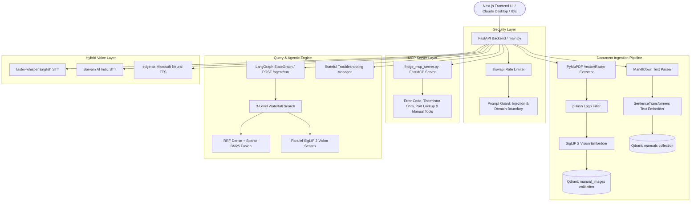

# 🐙 OCTO RAG: Multimodal Refrigerator Technical Assistant & MCP Server

A production-ready **Multimodal Retrieval-Augmented Generation (RAG) Assistant**, **State-Guided Troubleshooting Engine**, and **Model Context Protocol (MCP) Diagnostic Server** designed specifically for technical refrigerator, freezer, and cooling appliance support.

Octo RAG combines Next.js 14 human-centered UI, FastAPI async endpoints, SigLIP 2 visual diagram retrieval, hybrid RRF search, pre-LLM security domain guardrails, and standard MCP server tool capabilities.

---

## 🎯 Operational Problems Solved

* **⏱️ High Mean Time to Resolution (MTTR)**: Eliminates manual skimming through hundreds of pages of PDF/DOCX appliance manuals by extracting grounded answers and step-by-step diagnostic sequences in seconds.
* **💸 Escalation Ticket Overload**: Serves as an automated Tier-1/Tier-2 technician copilot. Its state-guided decision engine exhausts manual-backed diagnostic steps before triggering explicit human escalation (`ESCALATE`), reducing costly support ticket escalations.
* **🛑 Hands-Free Field Maintenance Constraints**: Provides a low-latency voice layer (STT + TTS) so technicians operating physical hardware can ask questions and hear audio instructions without stopping work to type.
* **🛡️ Zero-Token Cost Protection on Off-Topic Queries**: Enforces a Pre-LLM Refrigerator Domain Guardrail (`is_out_of_domain`), intercepting automotive, cooking, weather, financial, or off-topic prompts before reaching LLMs—expending **0 API tokens** on off-topic requests.
* **🔌 Universal Local Assistant Connectivity (MCP)**: Exposes refrigerator diagnostic tools (`lookup_error_code`, `get_thermistor_ohm_table`, `lookup_part_number`, `search_fridge_manuals`) via Model Context Protocol (MCP), plugging directly into **Claude Desktop**, IDEs, and local AI clients.
* **📋 SOP Non-Compliance & Audit Blind Spots**: Logs complete diagnostic session histories in a structured registry, recording every question asked, user answer, recommended action, and manual chunk reference for auditability.
* **⚡ Redundant Ingestion Compute Overhead**: Uses SQLite MD5 content-hash caching to detect unchanged files or web pages, skipping redundant chunking, embedding, and vector DB indexing.

---

## 🚀 Key Features

* **🎨 Human-Centered Octo RAG Interface**: Built with Next.js 14, React, TypeScript, and Tailwind CSS. Features a warm off-white canvas (`#F7F4EE`), burnt orange accent (`#C65D3A`), structured information cards, voice-first hero controls (`🎤 Tap to speak`), and guided step-by-step troubleshooting UI.
* **🔌 FastMCP Diagnostic Server Integration**: Runs a native MCP server (`fridge_mcp_server.py`) with stdio and FastAPI SSE transport (`/mcp/sse`). Exposes tools for error code lookup (`Er FF`, `SY EF`, `22 E`, `E5`), thermistor resistance calculation (kOhm), OEM part lookup, and manual vector search.
* **🛡️ Pre-LLM Security & Domain Boundary**: Intercepts prompt injections (`is_prompt_injection`) and non-refrigerator domain prompts (`is_out_of_domain`) at the FastAPI gateway level before calling LLM APIs.
* **📄 Multimodal Document & Visual Ingestion**: Converts uploads (`PDF`, `DOCX`, `PPTX`, `XLSX`, `TXT`) into Markdown using **Microsoft MarkItDown**. Extracts raster images and renders high-resolution vector path diagrams via **PyMuPDF**, applying perceptual hashing (`pHash`) to drop repeated header/footer logos.
* **🖼️ SigLIP 2 Visual Semantic Search**: Generates 768-dim multimodal embeddings using **Google SigLIP 2** (`google/siglip-base-patch16-224`) stored in a dedicated `manual_images` Qdrant collection, running parallel text and visual image retrieval.
* **🔍 Hierarchical Hybrid Search (RRF)**: Executes a 3-level prioritized waterfall search (Exact Product $\rightarrow$ Product Family $\rightarrow$ Global Search) combining dense vectors (`SentenceTransformers all-MiniLM-L6-v2`) and in-memory sparse keyword matching (`BM25`) using **Reciprocal Rank Fusion (RRF)**:
  $$\text{RRF Score}(d) = \sum_{m \in M} \frac{1}{60 + r_m(d)}$$
* **🦜 Bounded LangGraph Agentic Engine**: Orchestrates URL scraping (BeautifulSoup4), file version control, fuzzy product model matching, intent classification (`qa` vs `troubleshoot`), and step generation via a bounded **LangGraph `StateGraph`** (`POST /agent/run`).
* **🤖 Stateful Troubleshooting Orchestration**: Guides users through diagnostic trees tracking active state (`QUESTION`, `ACTION`, `VERIFY`, `RESOLVED`, `ESCALATE`), session history, and pinned RAG context blocks across user turns.
* **🎙️ Hybrid Voice Layer (STT & TTS)**: Transcribes incoming audio using local `faster-whisper` (`int8` CPU) for English or Sarvam AI (`Saaras v3 API`) for Indic/auto languages. Synthesizes speech outputs using **edge-tts** with Microsoft Neural voices.
* **🧪 40-Test Verification Suite**: 100% passing backend unit, security, prompt injection, domain boundary, retriever, vision pipeline, and MCP integration test suite (`pytest`).

---

## 🔌 Connecting Claude Desktop to Octo RAG (MCP)

Octo RAG connects natively to **Claude Desktop** via MCP:

Add the following to your local `%APPDATA%\Claude\claude_desktop_config.json`:

```json
{
  "mcpServers": {
    "octo-rag": {
      "command": "python",
      "args": [
        "C:/Users/SAMSUNG/OneDrive/Desktop/rag-multimodal-assistant/backend/app/mcp/fridge_mcp_server.py"
      ]
    }
  }
}
```

Restart Claude Desktop, and Claude will automatically discover Octo RAG's manual search, error code, thermistor, and part lookup tools!

---

## ⚡ Multi-Tier Caching Architecture

| Cache Layer | Storage Mechanism | Purpose | Benefit |
| :--- | :--- | :--- | :--- |
| **LRU Retrieval Cache** | In-memory Dict (`_RETRIEVAL_CACHE`, capacity=500) | Caches top RAG chunks by query key | Sub-5ms response time for repeated search queries |
| **LRU Embedding Cache** | `@lru_cache(maxsize=1024)` in `EmbedderService` | Caches text vector encodings | Eliminates duplicate embedding CPU computation |
| **SQLite Version Cache** | `registry.db` SQLite database table | Stores MD5 hashes of raw files & URLs | Skips re-chunking and re-embedding unchanged documents |
| **Session State Cache** | `SessionStore` (SQLite / In-memory) | Stores multi-turn diagnostic history & state | Preserves troubleshooting context across user turns |
| **ML Model Disk Cache** | Local Hugging Face Cache (`HF_HUB_OFFLINE=1`) | Stores local model weights on disk | Enables fast offline startup without downloading weights |

---

## 🛡️ Security & Rate Limiting Rules

All API routes are protected by **`slowapi` IP rate limiters**:

| Endpoint | Method | Rate Limit | Protection Scope |
| :--- | :--- | :--- | :--- |
| `/upload` | `POST` | `5 / minute` | CPU & storage protection against rapid file upload spam |
| `/agent/run` | `POST` | `10 / minute` | Limits complex LangGraph scraping and agent execution workflows |
| `/transcribe` | `POST` | `10 / minute` | Prevents STT audio processing queue saturation |
| `/chat` | `POST` | `20 / minute` | Rate limits standard RAG query generation |
| `/troubleshoot`| `POST` | `20 / minute` | Limits state-guided diagnostic turns |
| `/speak` | `POST` | `20 / minute` | Protects edge-tts text-to-speech generation |
| `/chat/stream` | `POST` | `30 / minute` | Controls Server-Sent Events (SSE) streaming connections |
| `/mcp/sse` | `GET` | Starlette/FastAPI | Streamable MCP Server-Sent Events endpoint |
| `/document-images/...` | `GET` | `60 / minute` | Prevents automated document image scraping |

---

## 🏗️ System Architecture Overview



---

## 📁 Project Structure

```text
rag-multimodal-assistant/
├── docker-compose.yml         # Container configuration for Backend + Frontend
├── architecture.md            # Complete architecture specs, sub-module breakdowns & flowcharts
├── context.md                 # Full project reference context, test suite matrix & benchmarks
├── README.md                  # Root project documentation
├── backend/
│   ├── Dockerfile             # Multi-stage Dockerfile with pre-cached model weights
│   ├── requirements.txt       # Hardened requirements (fastapi, mcp, slowapi, pytest, etc.)
│   ├── .env.example           # Environment template file
│   └── app/
│       ├── main.py            # FastAPI entrypoint, MCP mount, routes & rate limiters
│       ├── config.py          # Unified Settings manager using pathlib.Path
│       ├── mcp/
│       │   ├── __init__.py    # MCP package initialization
│       │   ├── fridge_mcp_server.py # FastMCP diagnostic & manual search server
│       │   └── mcp_client.py  # Diagnostic tool client helper service
│       └── services/
│           ├── parser.py      # MarkItDown parse & document ingestion engine
│           ├── image_extractor.py # PyMuPDF image & vector region extractor
│           ├── image_filters.py   # pHash & aspect ratio decorative image filters
│           ├── chunker.py     # Smart character overlapping chunker
│           ├── embedder.py    # SentenceTransformers singleton with LRU cache
│           ├── vision_embedder.py # SigLIP 2 multimodal vision embedder singleton
│           ├── vision_search.py   # SigLIP 2 image search service
│           ├── vector_store.py# Qdrant interface (manuals & manual_images dual collections)
│           ├── hybrid_search.py# In-memory BM25 sparse search and RRF fusion
│           ├── retriever.py   # 3-level waterfall hybrid search + parallel vision retrieval
│           ├── query_understanding.py # Query confidence analyzer & intent classifier
│           ├── context_reconstruction.py # Multi-turn query rewriter
│           ├── session_store.py   # SQLite multi-turn session state store
│           ├── prompt_guard.py    # Security regex injection & domain boundary guard
│           ├── agent_flow.py      # LangGraph unified agentic StateGraph
│           ├── workflow_manager.py# Multi-turn troubleshooting state machine
│           └── audio.py           # Speech Transcriber (Whisper/Sarvam) & TTS (edge-tts)
└── frontend/                  # Next.js 14 UI application codebase
```

---

## ⚙️ Quickstart & Local Setup

### 1. Setup Environment
Create a `backend/.env` file from the example template:
```bash
cp backend/.env.example backend/.env
```
Configure your LLM provider and API keys:
```env
LLM_PROVIDER=groq
GROQ_API_KEY=your_groq_api_key
# Optional: SAMBANOVA_API_KEY=your_sambanova_key
# Optional: SARVAM_API_KEY=your_sarvam_key
```

### 2. Launch with Docker Compose
To build and run the entire ecosystem (FastAPI Backend + Next.js Frontend + MCP Server + pre-cached model weights) locally:
```bash
docker compose up --build
```

### 3. Run Verification Test Suite
To run the complete 40-test verification suite locally inside the `backend` directory:
```bash
cd backend
python -m pytest -vv
```

---

## 🚀 Access Points & API Endpoints

* **Frontend UI (Octo RAG Console)**: [http://localhost:3000](http://localhost:3000)
* **Admin Upload Portal**: [http://localhost:3000/admin](http://localhost:3000/admin)
* **Interactive API Docs (Swagger)**: [http://localhost:8000/docs](http://localhost:8000/docs)
* **MCP SSE Endpoint**: `GET http://localhost:8000/mcp/sse`
* **Unified Agent Flow**: `POST http://localhost:8000/agent/run`
* **Stateful Troubleshooting**: `POST http://localhost:8000/troubleshoot`
* **Transcribe Endpoint**: `POST http://localhost:8000/transcribe`
* **Speak Endpoint**: `POST http://localhost:8000/speak`
* **Health Endpoint**: [http://localhost:8000/health](http://localhost:8000/health)
