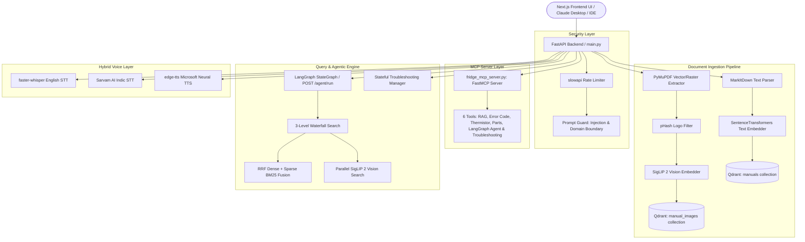

# OCTO-RAG — Multimodal RAG & AI Diagnostic Infrastructure

**OCTO-RAG** is a multimodal Retrieval-Augmented Generation (RAG) and agentic troubleshooting system built by **Santhosh Paramasivan** for technical appliance diagnostics — combining hybrid retrieval, vision search, stateful workflows, voice I/O, and a native MCP server.

**Author:** Santhosh Paramasivan
**GitHub:** [Santhosh-p653](https://github.com/Santhosh-p653)
**Focus:** AI Infrastructure · Multimodal RAG · Agentic AI · Model Context Protocol (MCP)

---

## What is OCTO-RAG?

A human-centered, production-oriented **Multimodal RAG Assistant**, **State-Guided Troubleshooting Engine**, and **MCP Diagnostic Server** for field service technicians, technical support centers, and appliance maintenance operations.

**Primary identity:** Multimodal RAG system for technical-document intelligence (refrigerator manuals, schematics, error codes).

**Secondary capabilities:**
- Agentic troubleshooting (LangGraph)
- Vision retrieval (SigLIP 2)
- Hybrid text retrieval (BM25 + dense + RRF)
- Voice interaction (STT/TTS)
- MCP tools for Claude Desktop / IDEs
- Pre-LLM security & domain guardrails
- Stateful diagnostic workflows

Stack: Next.js 14 console · FastAPI async backend · Qdrant · SigLIP 2 · LangGraph · FastMCP.

---

## Operational Problems Solved

### 1. High Mean Time to Resolution (MTTR)
Field technicians and support agents lose significant time manually searching PDF/DOCX manuals for wiring diagrams, error codes, and disassembly sequences.
- **Technician view**: structured answer cards with exact manual citations (`📄 Page 14`).
- **Ops view**: cuts per-ticket resolution time from tens of minutes to seconds.
- **Architecture**: 3-level waterfall search (Exact Product → Family Prefix → Global) fused with BM25 sparse matching via Reciprocal Rank Fusion (RRF, k=60), targeting low-latency retrieval.

### 2. Escalation Ticket Overload
Tier-1 desks escalate basic issues due to incomplete initial troubleshooting.
- **Technician view**: step-by-step interactive repair cards (`Step 2 of 4`, `[YES] [NO]`).
- **Ops view**: exhausts manual-backed diagnostics before explicit escalation (`ESCALATE`), reducing escalation volume in internal testing.
- **Architecture**: stateful session registry (`workflow_manager.py`) tracking `START → QUESTION → ACTION → VERIFY → RESOLVED/ESCALATE`.

### 3. Hands-Free Field Constraints
Technicians inside freezers or holding multimeter probes can't type queries.
- **Technician view**: voice trigger (`🎤 Tap to speak`) + read-aloud (`🔊 Listen to answer`).
- **Architecture**: hybrid voice pipeline (`audio.py`) — `faster-whisper` (int8 CPU) for English, Sarvam AI (Saaras v3) for Indic dialects, `edge-tts` for synthesis.

### 4. Token Cost Leakage
Off-topic prompts (recipes, car repairs, trivia) burn API cost on public LLM endpoints.
- **Architecture**: Pre-LLM domain guardrail (`is_out_of_domain` in `prompt_guard.py`) at the FastAPI gateway rejects off-topic prompts with `HTTP 400` before any LLM or vector DB call — zero token spend on rejected queries.

### 5. Tool Silos (MCP Standard)
Separate tools for manual search, error-code lookup, thermistor testing, and part verification fragment technician workflow.
- **Architecture**: native FastMCP server (`fridge_mcp_server.py`) exposing 6 diagnostic tools over stdio and SSE (`/mcp/sse`), usable directly inside Claude Desktop or IDEs.

### 6. Audit & SOP Compliance
No visibility into whether technicians followed official procedure.
- **Architecture**: all session state transitions recorded in SQLite (`SessionStore`) — questions, answers, recommended steps, manual citations — preserved across multi-turn sessions.

---

## Summary Matrix

| Problem | Technician View | Ops View | Architecture |
|---|---|---|---|
| High MTTR | Readable cards + page citations | Faster resolution | RRF hybrid search (dense + BM25, k=60) |
| Ticket overload | Interactive YES/NO cards | Fewer escalations | Stateful bounded workflow engine |
| Hands-free field use | Voice button + neural TTS | Improved technician safety | Whisper + Sarvam AI + edge-tts |
| Token cost leakage | Immediate off-topic feedback | Zero spend on rejected queries | Gateway pre-LLM guardrail |
| Tool silos | All tools inside Claude Desktop | Unified AI standard | FastMCP server (stdio & SSE) |
| Audit compliance | Clear SOP confirmations | Full ticket audit trail | SQLite session history |

---

## MCP Diagnostic Server (Claude Desktop & IDEs)

`fridge_mcp_server.py` exposes 6 FastMCP tools:

1. `search_fridge_manuals(query, source_file)` — grounded hybrid RRF search over Qdrant manuals.
2. `lookup_error_code(brand, model, code)` — resolves codes (`Er FF`, `SY EF`, `22 E`, `E5`, `88 88`) to PCB test points and repair steps.
3. `get_thermistor_ohm_table(temp_celsius)` — NTC thermistor resistance (kΩ) for multimeter diagnostics.
4. `lookup_part_number(model, component_name)` — OEM part numbers (`WR51X10055`, `WR07X10055`, `WR57X10032`), voltages, difficulty.
5. `run_octo_agent(query, source_input)` — full LangGraph `StateGraph` agentic pipeline (`agent_flow.py`).
6. `troubleshoot_appliance_turn(session_id, message)` — full stateful troubleshooting engine (`workflow_manager.py`).

**Claude Desktop setup** — add to `%APPDATA%\Claude\claude_desktop_config.json`:

```json
{
  "mcpServers": {
    "octo-rag": {
      "command": "C:\\Users\\SAMSUNG\\AppData\\Local\\Programs\\Python\\Python311\\python.exe",
      "args": [
        "C:\\Users\\SAMSUNG\\OneDrive\\Desktop\\rag-multimodal-assistant\\backend\\app\\mcp\\fridge_mcp_server.py"
      ]
    }
  }
}
```

---

## Architecture



---

## Caching

| Layer | Storage | Purpose | Benefit |
|---|---|---|---|
| LRU Retrieval Cache | In-memory dict (`_RETRIEVAL_CACHE`, cap=500) | Caches top RAG chunks by query key | Fast repeated-query response |
| LRU Embedding Cache | `@lru_cache(maxsize=1024)` in `EmbedderService` | Caches text vector encodings | Avoids duplicate embedding compute |
| SQLite Version Cache | `registry.db` | MD5 hashes of raw files/URLs | Skips re-chunking unchanged docs |
| Session State Cache | `SessionStore` (SQLite/in-memory) | Multi-turn diagnostic history | Preserves context across turns |
| ML Model Disk Cache | HF cache (`HF_HUB_OFFLINE=1`) | Local model weights | Fast offline startup |

---

## Security & Rate Limiting

`slowapi` IP-based limits per route:

| Endpoint | Method | Limit | Scope |
|---|---|---|---|
| `/upload` | POST | 5/min | Upload spam protection |
| `/agent/run` | POST | 10/min | LangGraph agent execution |
| `/transcribe` | POST | 10/min | STT queue protection |
| `/chat` | POST | 20/min | Standard RAG queries |
| `/troubleshoot` | POST | 20/min | State-guided diagnostic turns |
| `/speak` | POST | 20/min | TTS generation |
| `/chat/stream` | POST | 30/min | SSE streaming |
| `/mcp/sse` | GET | — | MCP SSE endpoint |
| `/document-images/...` | GET | 60/min | Image scraping protection |

---

## Evaluation

- Test suite: `python -m pytest` inside `backend/` — 42/42 passing.
- Retrieval latency, escalation-reduction, and MTTR figures above reflect internal project benchmarks, not measured production traffic — validate against your own deployment before quoting externally.

---

## Quickstart

- Frontend: `http://localhost:3000`
- Admin upload portal: `http://localhost:3000/admin`
- API docs (Swagger): `http://localhost:8000/docs`
- MCP SSE endpoint: `GET http://localhost:8000/mcp/sse`

---

## Author

**Santhosh Paramasivan**
AI Engineer — AI Infrastructure, Multimodal RAG, Agentic Systems, MCP

- GitHub: [`Santhosh-p653`](https://github.com/Santhosh-p653)
- LinkedIn: *(https://www.linkedin.com/in/santhosh-paramasivan)*
- Portfolio: *(https://santhosh-p653.github.io/portfolio/)*

