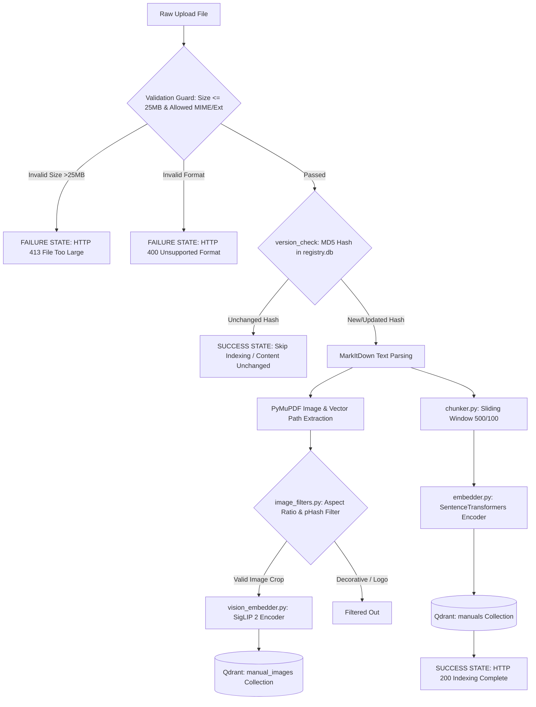
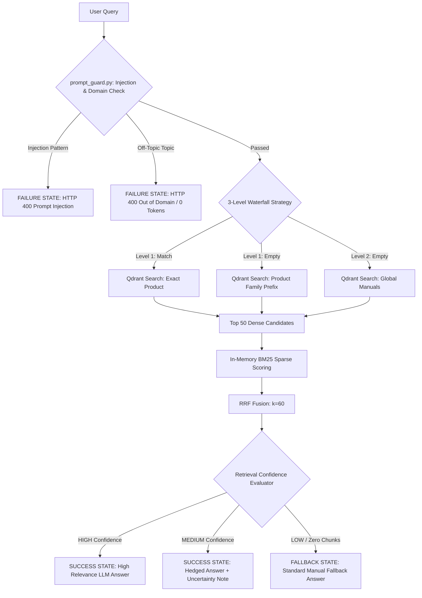
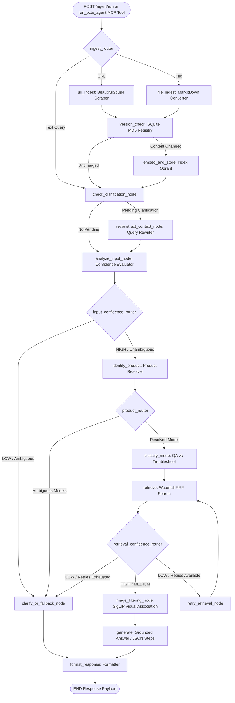
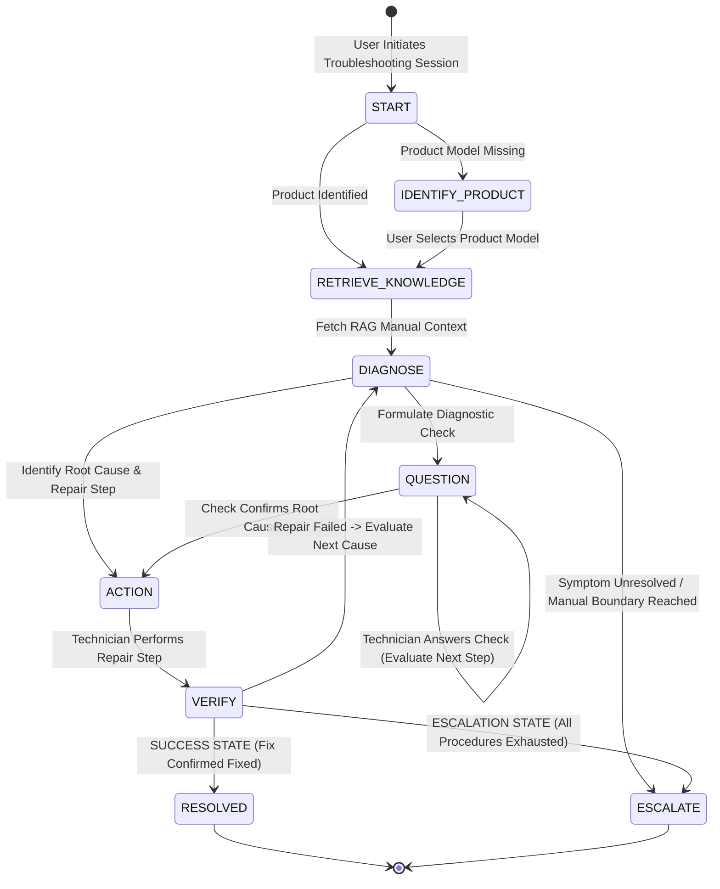
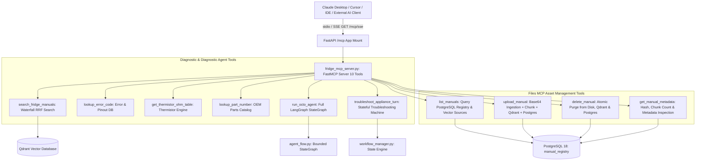
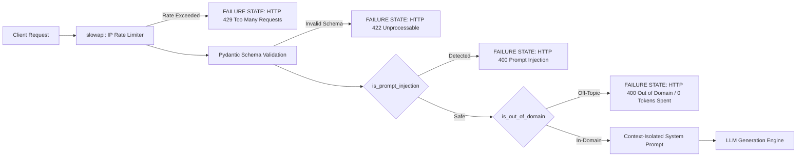
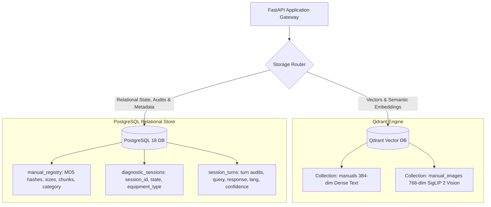
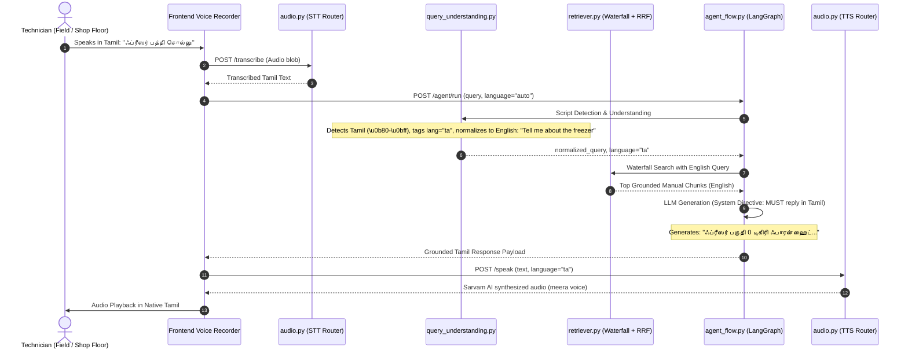

# Comprehensive Architecture Specification — OCTO RAG Assistant

This document provides an exhaustive technical specification of the systems, pipelines, submodule responsibilities, orchestration state machines, security layers, Model Context Protocol (MCP) servers, state transitions, success/failure fallback states, and key architectural decisions in the **OCTO RAG Assistant**.

---

## 1. Submodule Problem-Solving Matrix & Key Architectural Decisions

Every submodule in the backend is designed to solve specific technical problems with explicit architectural rationales:

| Submodule | Target Engineering Problem | Technical Solution & Implementation | Key Architectural Decision & Rationale |
| :--- | :--- | :--- | :--- |
| **`postgres.py`** | Lack of relational persistence, missing session history, file registry and turn audits | Async SQLAlchemy + `asyncpg` engine managing `manual_registry`, `diagnostic_sessions`, and `session_turns`. | **Dual-Database Decoupling**: Offloads relational state, metadata, and audit logs to PostgreSQL 18, keeping Qdrant as a dedicated high-throughput vector index. |
| **`fridge_mcp_server.py`** | External AI clients (Claude Desktop, IDEs) lacking diagnostic tools and file management | FastMCP server exposing 10 tools: RAG search, error codes, thermistor table, parts catalog, agent flow, troubleshooting turn, PLUS Files MCP tools (`list_manuals`, `upload_manual`, `delete_manual`, `get_manual_metadata`). | **Standard Open MCP Protocol & Thread Safety**: Exposes tools over stdio and FastAPI SSE (`/mcp/sse`) with thread-safe async event loop isolation (`_run_async_safely`). |
| **`mcp_client.py`** | Internal services requiring diagnostic lookup without network overhead | Programmatic client helper for invoking local MCP tools directly within Python nodes. | **Decoupled Tool Execution**: Prevents HTTP network overhead during internal Python service calls. |
| **`prompt_guard.py`** | Jailbreaks, prompt injection & off-topic LLM token waste | Regex filter intercepting injection patterns (`is_prompt_injection`) AND non-equipment domain topics (`is_out_of_domain`). | **Gateway Pre-LLM Boundary**: Rejects off-topic prompts *before* vector search or LLM invocation, expending **0 LLM API tokens** on rejected requests. |
| **`parser.py`** | Multi-format layout destruction in PDFs/DOCX | Uses **Microsoft MarkItDown** to render multi-format uploads into clean, unified Markdown text before chunking. | **Unified Text Schema**: Standardizes multi-format inputs into Markdown prior to chunking. |
| **`image_extractor.py`** | Loss of vector schematics & diagrams in PDFs | Combines PyMuPDF raster extraction with custom vector drawing region clustering (`get_vector_drawing_regions`), rendering CAD/wiring diagrams to PNGs. | **Vector Drawing Rendering**: Renders CAD path drawings missed by standard PDF image extractors. |
| **`image_filters.py`** | Qdrant vector bloat from decorative logos/lines | Applies aspect ratio bounds ($0.2 \le \text{AR} \le 5.0$), page area checks, and perceptual hash (`pHash`) deduplication ($\le 2$ repeat threshold). | **Perceptual Hash Filtering**: Drops header logos, footer icons, and line dividers before vector indexing. |
| **`chunker.py`** | Context loss across chunk boundaries | Uses a character-sliding window (`CHUNK_SIZE=500`, `OVERLAP=100`) while propagating metadata header tags to each chunk. | **Header Propagation**: Retains document headings and section context across overlapping chunks. |
| **`embedder.py`** | High CPU overhead for text vector encoding | Implements a thread-safe Singleton pattern for `SentenceTransformers` (`all-MiniLM-L6-v2`) with `@lru_cache(maxsize=1024)`. | **LRU Vector Caching**: Eliminates redundant model instantiation and duplicate text embedding calculations. |
| **`vision_embedder.py`** | Text-only search failing on visual manual content | Implements a SigLIP 2 Singleton (`google/siglip-base-patch16-224`) generating 768-dim joint text-image embeddings. | **Multimodal Shared Vector Space**: Enables cross-modal text-to-image semantic vector search. |
| **`vision_search.py`** | Irrelevant visual diagram retrieval | Queries the dedicated `manual_images` Qdrant collection, enforcing application-level `VISION_SCORE_THRESHOLD` filtering. | **Dual Vector Collection Isolation**: Keeps visual image vectors separate from text chunk vectors. |
| **`vector_store.py`** | Payload schema pollution & vector duplication | Maintains dual Qdrant collections (`manuals` & `manual_images`), performing deletion by source file before re-indexing. | **Source File Idempotency**: Ensures atomic re-indexing without duplicate stale vectors. |
| **`hybrid_search.py`** | Keyword mismatch in pure dense vector search | Implements in-memory **BM25** sparse ranking combined with dense candidate vectors using **Reciprocal Rank Fusion (RRF)** ($k=60$). | **Dense + Sparse Fusion**: Balances exact error code matching with broad semantic retrieval. |
| **`retriever.py`** | Empty search hits from strict metadata filters | Implements a 3-level waterfall search (Exact Product $\rightarrow$ Family Prefix $\rightarrow$ Global Search) run concurrently with SigLIP vision search. | **3-Level Waterfall Strategy**: Eliminates search drop-offs while prioritizing exact product documentation. |
| **`query_understanding.py`** | English-only assumption failing on Indic multilingual input | Unicode script range analyzer (`detect_query_script`), English query normalization for RAG retrieval, and language tag preservation (`ta`, `hi`, `en`). | **Cross-Lingual Intent Normalization**: Enables high-precision English technical document retrieval while preserving the technician's native language. |
| **`agent_flow.py`** | Language mismatch between query and response + console crash | Bounded **LangGraph `StateGraph`** with native-script LLM prompt directives, localized generation, and Unicode-safe logging (`_safe_log`). | **End-to-End Localization & Encoding Safety**: Guarantees native language answers for Indic users and prevents Windows `cp1252` console crashes. |
| **`workflow_manager.py`**| LLM state drift in multi-turn diagnostic chats | Implements a state-guided session registry (`START` $\rightarrow$ `QUESTION` $\rightarrow$ `ACTION` $\rightarrow$ `VERIFY` $\rightarrow$ `RESOLVED`/`ESCALATE`). | **SOP State Enforcement**: Enforces structured diagnostic discipline, preventing premature repair steps. |
| **`audio.py`** | Indic language voice failures and pronunciation drift | Hybrid routing: Sarvam AI (`saaras:v2` STT & `bulbul:v1` TTS with `meera`/`arvind` voices) for Indic, `faster-whisper` and `edge-tts` for English. | **Voice Engine Specialization**: Directs Indic speech to Sarvam AI and English speech to local Whisper/edge-tts. |
| **`main.py`** | System DDoS and resource exhaustion | Wraps all routes in `slowapi` rate limiters, mounts `/mcp` SSE endpoint, and exposes PostgreSQL audit & session endpoints. | **API Rate Limiting & Lifecycle Governance**: Protects endpoints and exposes session audit telemetries. |

---

## 2. Multimodal Ingestion Pipeline (Workflows & Fallback States)

### Ingestion States & Fallbacks
1. **Validation Rejection States**: `HTTP 413` for files $>25\text{MB}$; `HTTP 400` for unsupported MIME types.
2. **Version Cache Skip State**: If raw file MD5 matches `registry.db`, chunking and vector embedding are skipped completely.
3. **Image Extraction Fallback State**: If PyMuPDF encounters corrupt vector graphics or zero images, document processing falls back gracefully to text-only vector indexing without throwing errors.

---

## 3. Context-Aware Hierarchical Retrieval & Confidence Routing

### Retrieval States & Fallbacks
1. **HIGH Confidence State**: Top RRF chunks match query entities directly. Returns grounded answer with exact page citations.
2. **MEDIUM Confidence State**: Chunks cover query partially or product hint differs slightly. Returns answer instructed to hedge with uncertainty warnings.
3. **LOW Confidence Fallback State**: Zero hits or top score below threshold. Returns exact standardized fallback string: `"I could not find that information in the uploaded manuals. The query might be too vague or unrelated to the manuals."`

---

## 4. LangGraph Unified Agentic Execution Pipeline (`agent_flow.py`)

### Agentic Graph States
* **`status: "answered"`**: Grounded answer generated successfully.
* **`status: "needs_clarification"`**: Multiple matching product models found; prompts user to clarify.
* **`status: "fallback"`**: Context retrieval failed or yielded no relevant chunks.
* **`retry_retrieval_node`**: Automatic retry state triggering up to `MAX_RETRIEVAL_RETRIES` (default 2) before dropping to fallback.

---

## 5. Stateful Troubleshooting Engine (`workflow_manager.py`)

### Troubleshooting States
1. **`START`**: Initialized session.
2. **`IDENTIFY_PRODUCT`**: Prompting user for appliance model number.
3. **`QUESTION`**: Asking technician a diagnostic verification question (e.g. *"Is power light ON?"*).
4. **`ACTION`**: Providing a specific manual repair procedure.
5. **`VERIFY`**: Asking technician to confirm if repair step resolved issue.
6. **`RESOLVED` (Success State)**: Issue resolved; session closed successfully.
7. **`ESCALATE` (Escalation State)**: Manual steps exhausted; recommends human technician dispatch.

---

## 6. Model Context Protocol (MCP) Server Architecture

### Thread-Safe Async MCP Execution (`_run_async_safely`)
FastMCP runs synchronous Python tool functions within client runner threads. Directly executing `asyncio.run(coroutine)` on an existing coroutine across threads creates `'NoneType' object has no attribute 'send'`. OCTO-RAG implements a thread-safe helper `_run_async_safely(async_fn, *args, **kwargs)` that instantiates fresh coroutines in a clean, dedicated worker thread event loop via `concurrent.futures.ThreadPoolExecutor`.

---

## 7. Security, Pre-LLM Guardrail & Rate Limiting Mechanics

---

## 8. Dual-Database Relational + Vector Architecture

### Decoupling Rationale
1. **Vector Performance**: Qdrant handles high-dimensional HNSW vector search without relational index overhead.
2. **ACID Metadata Integrity**: PostgreSQL enforces unique constraints on document MD5 hashes, ensuring duplicate files are instantly detected before initiating expensive chunking or embedding.
3. **Technician Audit Trail**: Multi-turn troubleshooting steps, user feedback, and model citations are persisted permanently for regulatory and SOP compliance.

---

## 9. Multilingual Voice & Query-to-Response Pipeline

---

## 10. Decoupled Dual UI Architecture

1. **User / Technician Console (`/` and `/app`)**:
   - Zero admin buttons or configuration forms.
   - Large hands-free voice trigger and auto-playing regional voice synthesis.
   - Step-by-step diagnostic verification cards with structured SOP actions.
   - Multimodal schematic zoom viewer for wiring diagrams.

2. **Admin Asset & SOP Portal (`/admin`)**:
   - Database telemetry cards: PostgreSQL connection status, total registered manuals, stored sessions, active turns.
   - Drag-and-drop manual ingestion with progress bars and equipment categorization tags (`industrial`, `automobile`, `appliance`).
   - File deletion modal with complete Qdrant vector and PostgreSQL cleanup.
   - Real-time audit activity timeline showing technician query turns, confidence scores, and matched source documents.

