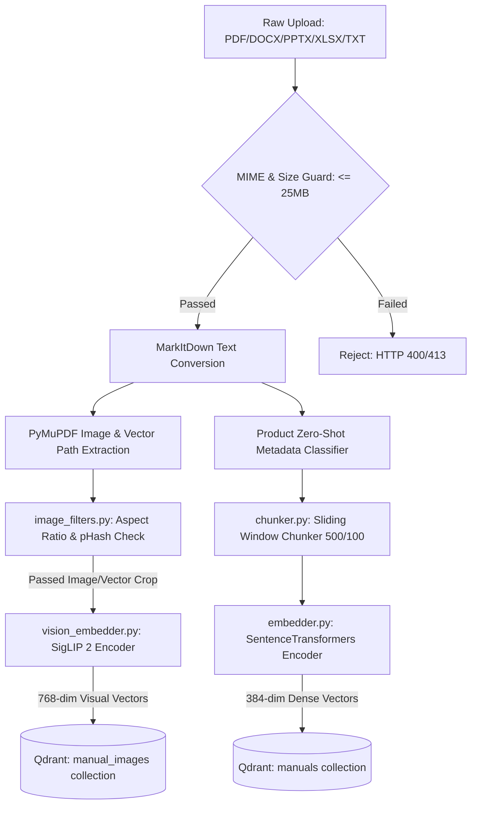
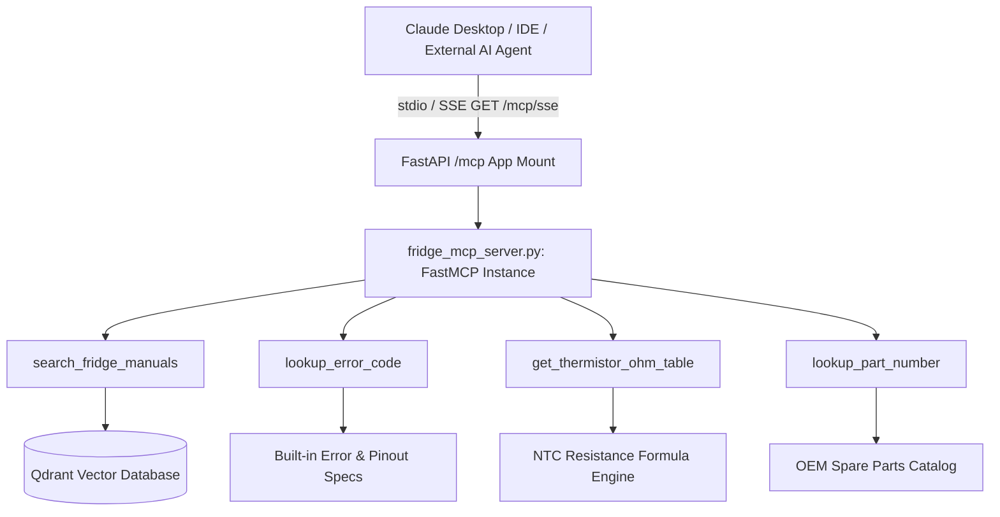
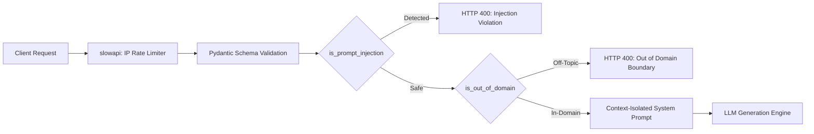
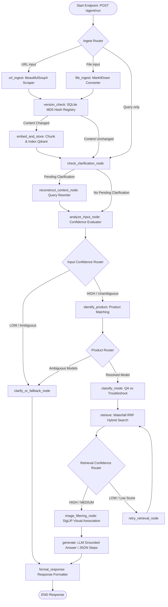

# Comprehensive Architecture Specification — OCTO RAG Assistant

This document provides a technical breakdown of the systems, pipelines, submodule problem-solving responsibilities, orchestration state machines, security layers, Model Context Protocol (MCP) servers, and architectural decisions implemented in the OCTO RAG Assistant.

---

## 1. Submodule Problem-Solving Matrix

Every submodule in the backend is designed to resolve specific technical and operational challenges:

| Submodule | Target Engineering Problem | Technical Solution & Implementation | Key Architectural Decision |
| :--- | :--- | :--- | :--- |
| **`fridge_mcp_server.py`** | External AI clients (Claude Desktop, IDEs) lacking diagnostic tool access | Implements a **FastMCP** server exposing `lookup_error_code`, `get_thermistor_ohm_table`, `lookup_part_number`, and `search_fridge_manuals`. | Exposes tools over stdio and FastAPI SSE (`/mcp/sse`), establishing standard MCP protocol compatibility. |
| **`mcp_client.py`** | Internal services requiring diagnostic lookup without network overhead | Programmatic client helper for invoking local MCP tools directly within Python nodes. | Decouples MCP tool logic from FastAPI routing and agent nodes. |
| **`prompt_guard.py`** | Jailbreaks, prompt injection & off-topic LLM token waste | Regex filter intercepting injection patterns (`is_prompt_injection`) AND non-refrigerator domain topics (`is_out_of_domain`). | Rejects non-refrigerator prompts at the API boundary, spending **0 LLM API tokens** on off-topic requests. |
| **`parser.py`** | Multi-format layout destruction in PDFs/DOCX | Uses **Microsoft MarkItDown** to render files into unified Markdown text before chunking. | Standardizes text schemas regardless of initial file extension. |
| **`image_extractor.py`** | Loss of vector schematics & diagrams in PDFs | Combines PyMuPDF raster extraction with custom vector drawing region clustering (`get_vector_drawing_regions`), rendering path diagrams to PNGs. | Captures electrical circuit blueprints and CAD path drawings missed by standard PDF image extractors. |
| **`image_filters.py`** | Qdrant vector bloat from decorative logos/lines | Applies aspect ratio bounds ($0.2 \le \text{AR} \le 5.0$), page area checks, and perceptual hash (`pHash`) deduplication ($\le 2$ repeat threshold). | Filters out header logos, footer icons, and line dividers before vector indexing. |
| **`chunker.py`** | Context loss across chunk boundaries | Uses a character-sliding window (`CHUNK_SIZE=500`, `OVERLAP=100`) while propagating metadata header tags to each chunk. | Retains document headings and section context across overlapping chunks. |
| **`embedder.py`** | High CPU overhead for text vector encoding | Implements a thread-safe Singleton pattern for `SentenceTransformers` (`all-MiniLM-L6-v2`) with `@lru_cache(maxsize=1024)`. | Eliminates redundant model instantiation and duplicate text embedding calculations. |
| **`vision_embedder.py`** | Text-only search failing on visual manual content | Implements a SigLIP 2 Singleton (`google/siglip-base-patch16-224`) generating 768-dim joint text-image embeddings. | Enables cross-modal text-to-image semantic vector search. |
| **`vision_search.py`** | Irrelevant visual diagram retrieval | Queries the dedicated `manual_images` Qdrant collection, enforcing application-level `VISION_SCORE_THRESHOLD` filtering. | Separates image vector search from text chunk search boundaries. |
| **`vector_store.py`** | Payload schema pollution & vector duplication | Maintains dual Qdrant collections (`manuals` & `manual_images`), performing deletion by source file before re-indexing. | Guarantees vector uniqueness and isolation between text and visual assets. |
| **`hybrid_search.py`** | Keyword mismatch in pure dense vector search | Implements in-memory **BM25** sparse ranking combined with dense candidate vectors using **Reciprocal Rank Fusion (RRF)** ($k=60$). | Balances exact keyword/error code matching with semantic intent retrieval. |
| **`retriever.py`** | Empty search hits from strict metadata filters | Implements a 3-level waterfall search (Exact Product $\rightarrow$ Family Prefix $\rightarrow$ Global Search) run concurrently with SigLIP vision search. | Eliminates search drop-offs while prioritizing exact product documentation. |
| **`agent_flow.py`** | Uncontrolled agent loops & redundant re-indexing | Uses a bounded **LangGraph `StateGraph`** with SQLite MD5 hash version checking (`registry.db`). | Ensures deterministic state transitions and skips re-embedding unchanged documents. |
| **`workflow_manager.py`**| LLM state drift in multi-turn diagnostic chats | Implements a state-guided session registry (`START` $\rightarrow$ `QUESTION` $\rightarrow$ `ACTION` $\rightarrow$ `VERIFY` $\rightarrow$ `RESOLVED`/`ESCALATE`). | Enforces SOP diagnostic discipline, preventing repetitive or premature fixes. |
| **`audio.py`** | High latency & Indic language accent failures | Hybrid routing: local `faster-whisper` (`int8` CPU) for English, Sarvam AI (`Saaras v3`) for Indic audio, and `edge-tts` for neural speech synthesis. | Provides fast English STT while preserving accuracy for Indic regional dialects. |
| **`main.py`** | System DDoS and resource exhaustion | Wraps all routes in `slowapi` rate limiters, mounts `/mcp` SSE endpoint, and pre-warms models during startup. | Enforces API rate limits and mounts MCP server transport. |

---

## 2. Multimodal Document & Visual Ingestion Pipeline

---

## 3. Model Context Protocol (MCP) Server Architecture

---

## 4. Pre-LLM Security & Domain Boundary Architecture

---

## 5. LangGraph Unified Agentic Execution Pipeline

The `POST /agent/run` endpoint executes a bounded **LangGraph `StateGraph`**:

---

## 6. Agentic Troubleshooting Orchestration State Machine

For diagnostic support, the system tracks structured state across user turns ([workflow_manager.py](file:///c:/Users/SAMSUNG/OneDrive/Desktop/rag-multimodal-assistant/backend/app/services/workflow_manager.py)):

