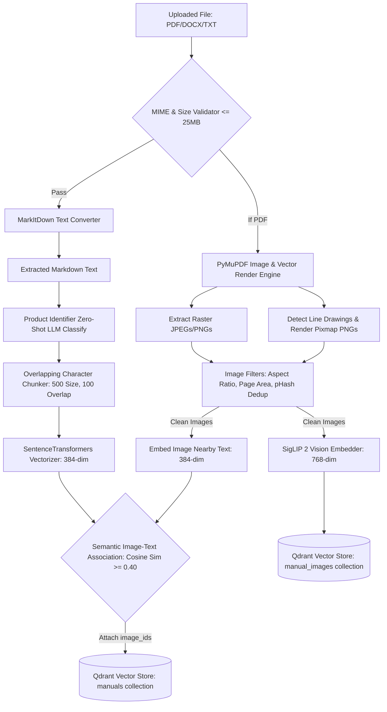
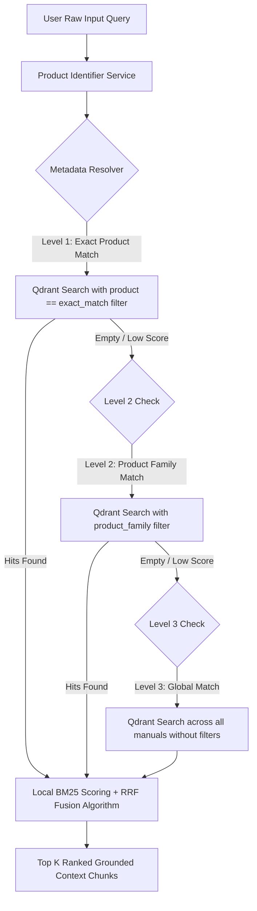
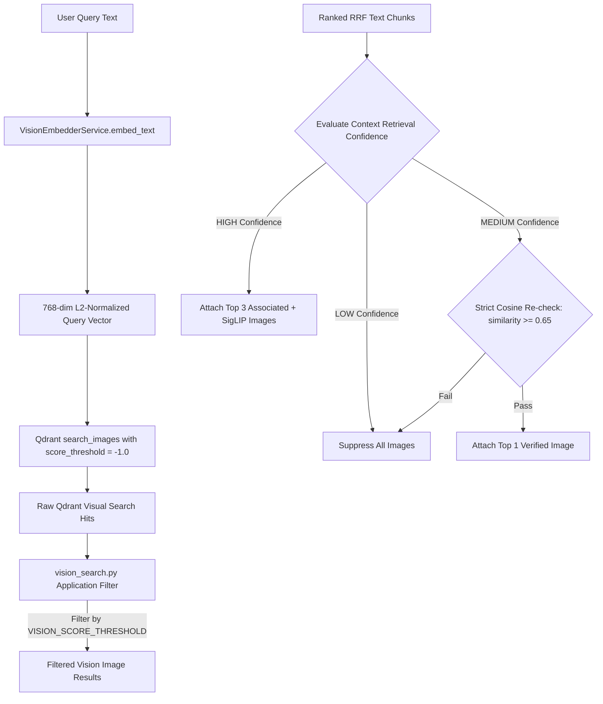
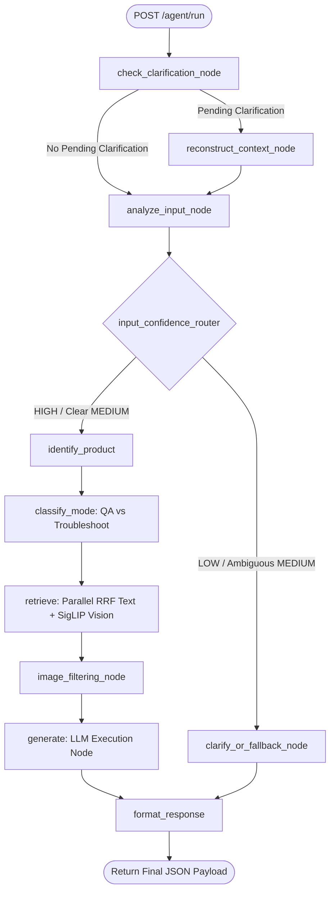
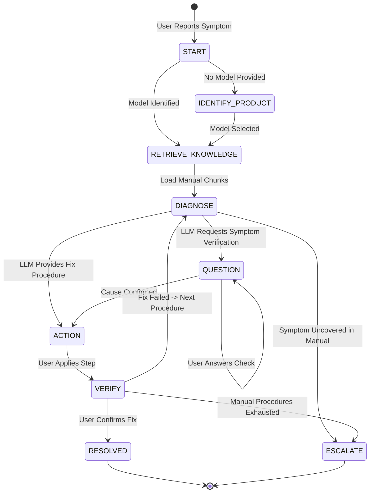
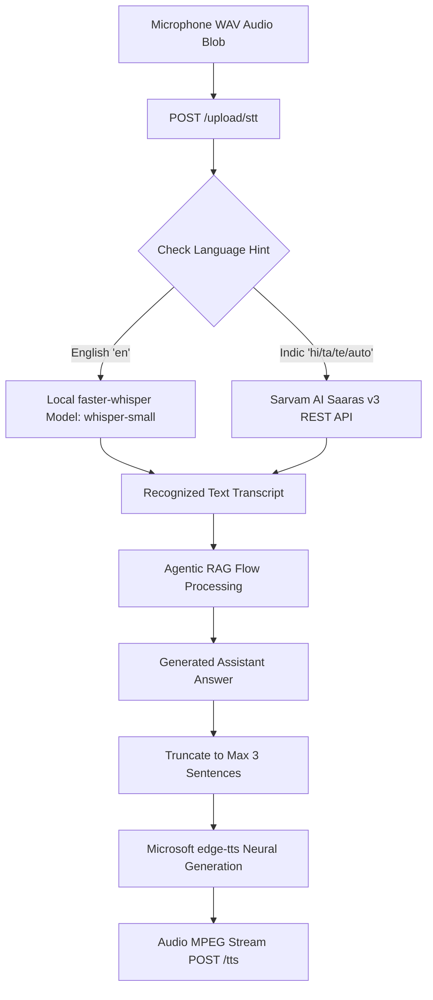

# Architecture Specification — OCTO-RAG Assistant & Agentic Engine

This document provides a comprehensive technical breakdown of the systems, pipelines, orchestration state machines, vector databases, high-performance in-memory caching, parallel async retrieval, real-time SSE streaming, and security layers implemented in **OCTO-RAG**. Every pipeline step is accompanied by a Mermaid diagram, deep operational explanations, payload schemas, and explicit architectural justifications.

---

## 1. Document Ingestion & Multimodal Extraction Pipeline

### Pipeline Architecture Diagram



### Detailed Step-by-Step Execution

1. **Upload Validation & Old Vector Purging**:
   - *Process*: `main.py` enforces a 25MB upper bound and checks file extensions and MIME headers using `python-magic`. Before indexing new content, `VectorStoreService.delete_by_filename()` wipes all previous vectors matching the filename in both `manuals` and `manual_images` collections.
   - *Justification*: Prevents memory waste and obsolete chunk retention when users re-upload updated manual versions.

2. **Dual-Path Graphic Extraction (Raster & Vector Graphics)**:
   - *Process*: `image_extractor.py` uses PyMuPDF to extract standard raster images (JPEGs/PNGs). Simultaneously, it parses PDF vector drawing paths (`page.get_drawings()`), clusters adjacent geometric elements, renders them to a 300 DPI PNG pixmap canvas, and saves them to disk.
   - *Justification*: Technical diagrams, wire schematics, and flowcharts in engineering documentation are often stored as vector paths rather than embedded raster bitmaps. Standard RAG parsers ignore vector drawings entirely.

3. **Perceptual Hashing & Heuristic Filtering**:
   - *Process*: `image_filters.py` evaluates extracted visuals:
     - Rejects extreme aspect ratios (e.g., thin lines with ratio $> 10:1$).
     - Rejects images taking up $< 1\%$ or $> 90\%$ of page area.
     - Computes perceptual hashes via `imagehash.phash()`. If the same pHash appears across $> 2$ pages, it is flagged as a repeating header/footer logo and dropped.
   - *Justification*: Prevents non-informative UI decorations, brand logos, and page dividers from polluting vector search indexes.

4. **Zero-Shot Product Metadata Extraction**:
   - *Process*: The first 1500 characters of parsed document text are sent to the LLM to identify the product model name (e.g., `X100`), falling back to regex matching (`[A-Z]\d{3,4}`) if the LLM call fails.
   - *Justification*: Guarantees that metadata tags are attached to chunks automatically, enabling fast filtered queries during RAG retrieval.

5. **Sliding Window Chunking**:
   - *Process*: `chunker.py` splits text into 500-character segments with 100-character overlap, injecting document metadata headers (`product`, `model`, `source_file`, `page`) into each chunk payload.
   - *Justification*: Overlapping windows preserve context across sentence boundaries, while metadata injection ensures downstream LLMs receive full document context.

6. **Semantic Image-Text Association**:
   - *Process*: The 384-dim SentenceTransformer embedding of the chunk text is compared via cosine similarity against the embedding of the image's `nearby_text` (text within 200pt of the image position). If similarity $\ge 0.40$, the `image_id` is linked inside the chunk's payload array.
   - *Justification*: Pre-associating relevant diagram IDs with specific text chunks enables immediate visual display during text retrieval.

7. **SigLIP 2 Visual Indexing**:
   - *Process*: If `ENABLE_VISION_INDEXING=True`, `vision_embedder.py` encodes each image file into a 768-dim L2-normalized vector using `google/siglip-base-patch16-224` and upserts it into the `manual_images` Qdrant collection.
   - *Justification*: Enables independent cross-modal semantic image retrieval directly from natural language text queries.

### Qdrant Point Payload Schemas

#### Text Collection Payload (`manuals`)
```json
{
  "chunk_id": "x100_manual.pdf::chunk_12",
  "content": "To resolve Error E105, power off the device, remove the rear panel...",
  "source_file": "x100_manual.pdf",
  "product": "X100",
  "model": "X100",
  "category": "Thermal Printer",
  "page": 24,
  "image_ids": ["img_p24_1.png"]
}
```

#### Vision Collection Payload (`manual_images`)
```json
{
  "image_id": "img_p24_1.png",
  "source_file": "x100_manual.pdf",
  "page_number": 24,
  "image_path": "backend/app/static/images/img_p24_1.png",
  "nearby_text": "Figure 4: Rear panel disassembly and power supply unit connector location",
  "caption": "Diagram showing power supply removal steps",
  "product": "X100",
  "model": "X100"
}
```

---

## 2. Context-Aware Hierarchical RRF Hybrid Search

### Pipeline Architecture Diagram



### Detailed Step-by-Step Execution

1. **Entity Extraction & Query Intent**:
   - *Process*: `product_identifier.py` analyzes the raw user query to extract mentioned product models (e.g., `"How do I replace fuse on X100?"` $\rightarrow$ `product="X100"`).
   - *Justification*: Scoping searches to specific product models eliminates false positive matches from unrelated user manuals.

2. **3-Level Waterfall Search Hierarchy**:
   - *Process*:
     - **Level 1**: Queries Qdrant using an exact filter on `product == extracted_product`.
     - **Level 2**: If Level 1 returns fewer than 3 hits or max similarity $< 0.50$, queries Qdrant filtering by product family prefix (e.g., `X-Series`).
     - **Level 3**: If Level 2 yields insufficient hits, removes all filters and executes a global search across the entire `manuals` collection.
   - *Justification*: Prioritizes exact model context while gracefully falling back to broader product manuals when exact matches are unavailable.

3. **Reciprocal Rank Fusion (RRF)**:
   - *Process*: `hybrid_search.py` calculates BM25 sparse keyword scores for all candidate chunks, ranks them independently alongside dense cosine similarity ranks, and combines the ranks via RRF:
     $$\text{RRF Score}(d) = \sum_{m \in \{\text{dense}, \text{sparse}\}} \frac{1}{k + r_m(d)} \quad (k = 60)$$
   - *Justification*: RRF combines dense semantic retrieval with exact keyword matching without requiring manual score normalization or weight tuning.

---

## 3. SigLIP 2 Visual Information Retrieval & Dynamic Filtering

### Pipeline Architecture Diagram



### Detailed Step-by-Step Execution

1. **Text Query Vectorization via SigLIP Text Encoder**:
   - *Process*: `VisionEmbedderService.embed_text(query)` converts the natural language user query into a 768-dim vector using SigLIP 2's text transformer tower, applying L2 normalization.
   - *Justification*: SigLIP's dual-encoder maps text and image modalities into a unified vector space, allowing text queries to match visual diagrams directly.

2. **Qdrant Search with Score Threshold Bypass**:
   - *Process*: `VectorStoreService.search_images()` invokes Qdrant with `score_threshold=-1.0`, returning raw cosine distance scores without vector DB dropouts.
   - *Justification*: Delegating thresholding to `vision_search.py` allows dynamic threshold adjustments (e.g. setting `VISION_SCORE_THRESHOLD=0.0` during development or unit testing) without modifying Qdrant collection settings.

3. **Dynamic Context-Aware Visual Gating**:
   - *Process*:
     - If text retrieval confidence is **HIGH**, up to 3 images (combining text-linked `image_ids` and SigLIP vision hits) are returned.
     - If text retrieval confidence is **MEDIUM**, the system calculates a strict cosine similarity between the chunk embedding and the image's `nearby_text`. Only images with similarity $\ge 0.65$ are allowed.
     - If text retrieval confidence is **LOW**, all image displays are suppressed.
   - *Justification*: Prevents unrelated or misleading diagrams from appearing when context confidence is marginal.

---

## 4. Unified LangGraph Agentic Orchestration State Machine

### LangGraph Workflow Graph Diagram



### Node Boundary & Execution Specifications

1. `check_clarification_node`: Intercepts active sessions waiting for user clarification.
2. `reconstruct_context_node`: Fuses brief follow-up replies with prior conversational state.
3. `analyze_input_node`: Evaluates prompt clarity, domain relevance, and potential ambiguities.
4. `identify_product`: Determines product model entity via fuzzy index lookups and regex pattern matching.
5. `classify_mode`: Categorizes user intent as informational (`qa`) or procedural diagnostic (`troubleshoot`).
6. `retrieve`: Executes parallel hybrid RRF text retrieval and SigLIP vision vector search.
7. `image_filtering_node`: Applies strict confidence-based image gating.
8. `generate`: Injects RAG context blocks into system prompts and calls the LLM engine.
9. `format_response`: Assembles the final output schema, formatting image URLs and audio stream metadata.

### LangGraph State Schema (`AgentState`)
```python
class AgentState(TypedDict):
    query: str
    source_input: Optional[str]
    source_content: Optional[bytes]
    product_id: Optional[str]
    clarification_needed: bool
    retrieved_chunks: list[dict]
    sources: list[dict]
    mode: Literal["qa", "troubleshoot"]
    answer: str
    steps: list[str]
    content_changed: bool
    version_info: Optional[str]
    clarification_options: list[str]
    images: list[dict]
    input_confidence: str
    retrieval_confidence: str
```

---

## 5. Multi-Turn Diagnostic Troubleshooting Engine

### Troubleshooting State Machine Diagram



### Session Registry Schema (SQLite `SessionStore`)
```python
{
    "session_id": "session_98234",
    "product": "X100",
    "issue": "Error Code E105",
    "step": 2,
    "status": "QUESTION",
    "last_question": "Is the status LED blinking red or solid orange?",
    "last_action": "Open rear door and check ribbon cable connection.",
    "history": [
        {"question": "Is the unit powered on?", "answer": "Yes"},
        {"question": "Is the status LED blinking red or solid orange?", "answer": "Blinking red"}
    ],
    "context": [...]
}
```

---

## 6. Voice Communication Layer (STT & TTS)

### Voice Pipeline Architecture Diagram



### Detailed Design Decisions

1. **Dual-Engine Speech-to-Text**:
   - *Logic*: Directs English audio to local `faster-whisper` (`whisper-small` running on CPU in INT8 precision). Directs Indic regional languages to Sarvam AI's `Saaras v3` API.
   - *Justification*: `faster-whisper` provides zero-latency offline transcription for English, while Sarvam AI provides high accuracy on Indic accents and code-switched phrases.

2. **Latency-Optimized Response Truncation**:
   - *Logic*: Before calling `edge-tts`, long responses are truncated to the first 3 complete sentences.
   - *Justification*: Reduces neural speech synthesis duration, ensuring TTS playback begins within <500ms of query completion.

---

## 7. Security Defense-in-Depth Pipeline

### Security Architecture Diagram


### Security Layer Specifications

1. **IP Rate Limiting (`slowapi`)**:
   - Limits LLM generation endpoints (`/agent/run`) to 5 requests/min per IP.
   - Limits file uploads (`/upload`) to 10 requests/min per IP.

2. **File & Payload Validation**:
   - Enforces a 25MB maximum upload size.
   - Validates file MIME signatures using `python-magic` to block executable files disguised with `.pdf` extensions.

3. **Prompt Injection Shield (`prompt_guard.py`)**:
   - Filters inputs against regex patterns targeting instruction override attempts (e.g., `"ignore previous instructions"`, `"system prompt"`, `"jailbreak"`).

4. **Context Isolation Prompting**:
   - RAG manual chunks are injected into system prompts inside rigid delimiters:
     ```text
     --- START SOURCE DOCUMENT ---
     {chunk_content}
     --- END SOURCE DOCUMENT ---
     ```
   - System instructions explicitly direct the LLM to treat content within delimiters strictly as reference data, ignoring any commands contained within it.

---

## 9. Current System Status & Test Suite Verification

The backend test suite consists of **34 unit, security, integration, and vision tests**. All 34 tests pass with 100% success rate.

### Complete Backend Test Matrix

| Test Category | Test File | Test Case | Status | Verification Summary |
| :--- | :--- | :--- | :---: | :--- |
| **Security** | `test_file_uploads.py` | `test_file_size_validation` | **PASSED** | Rejects uploads $> 25\text{MB}$. |
| | | `test_invalid_extensions` | **PASSED** | Blocks non-allowed file extensions. |
| | | `test_invalid_mime_types` | **PASSED** | Detects MIME spoofing via python-magic. |
| | | `test_valid_upload` | **PASSED** | Accepts valid PDF documents. |
| | | `test_valid_ppt_xls_uploads` | **PASSED** | Validates structured document parsing. |
| | `test_input_validation.py`| `test_empty_query` | **PASSED** | Rejects empty user input strings. |
| | | `test_oversized_query` | **PASSED** | Rejects query strings exceeding size caps. |
| | | `test_troubleshoot_constraints` | **PASSED** | Enforces valid troubleshooting state schemas. |
| | `test_prompt_injection.py`| `test_prompt_injection_detection`| **PASSED** | Flags override patterns (`ignore previous`). |
| | | `test_safe_messages` | **PASSED** | Passes standard domain queries. |
| | `test_rate_limits.py` | `test_rate_limits_chat` | **PASSED** | Enforces rate limits on HTTP endpoints. |
| **API** | `test_api.py` | `test_api_health` | **PASSED** | Verifies `/health` endpoint response. |
| | | `test_api_chat` | **PASSED** | End-to-end `/agent/run` execution test. |
| **Voice** | `test_audio.py` | `test_voice_tts_generation` | **PASSED** | Mocks edge-tts neural voice output. |
| | | `test_local_stt_transcription` | **PASSED** | Mocks faster-whisper STT output. |
| **Ingestion** | `test_chunker.py` | `test_chunk_markdown_structure` | **PASSED** | Validates 500-char window overlap & headers. |
| | `test_image_extraction.py`| `test_extract_images_filters_by_size`| **PASSED** | Verifies aspect ratio & surface area filters. |
| | | `test_extract_images_filters_repeated`| **PASSED** | Verifies pHash header/logo suppression. |
| | `test_parser.py` | `test_parser_service` | **PASSED** | End-to-end PDF parsing and chunk linking. |
| | `test_product_identifier.py`| `test_product_identifier_fallback`| **PASSED** | Tests regex extraction fallback. |
| | | `test_product_identifier_llm` | **PASSED** | Tests LLM zero-shot product extraction. |
| **Retrieval**| `test_embedder.py` | `test_embedder` | **PASSED** | SentenceTransformers singleton validation. |
| | `test_hybrid_search.py` | `test_bm25_search_indexing` | **PASSED** | Verifies BM25 sparse keyword indexing. |
| | | `test_rrf_combination` | **PASSED** | Tests Reciprocal Rank Fusion math. |
| | `test_retriever.py` | `test_retriever_prioritized_hierarchy`| **PASSED** | Verifies 3-level waterfall search. |
| | `test_image_association.py`| `test_image_filtering_node_high_confidence`| **PASSED** | Attaches up to 3 images on HIGH confidence. |
| | | `test_image_filtering_node_low_confidence`| **PASSED** | Suppresses images on LOW confidence. |
| | `test_troubleshooting_agent.py`| `test_troubleshooting_agent_logic`| **PASSED** | Verifies state machine transitions. |
| | `test_vector_store.py` | `test_vector_store_operations` | **PASSED** | Verifies Qdrant CRUD & collections. |
| **Vision** | `test_vision_pipeline.py`| `test_vision_embedder_singleton` | **PASSED** | SigLIP 2 singleton initialization test. |
| | | `test_vision_embedder_text` | **PASSED** | SigLIP 768-dim text encoding test. |
| | | `test_vision_embedder_image` | **PASSED** | SigLIP 768-dim image encoding test. |
| | | `test_vision_vector_store_ingestion_and_search`| **PASSED** | Dual Qdrant collection vector retrieval test. |
| | | `test_retrieve_context_with_vision_compatibility`| **PASSED** | Parallel text + vision RAG integration test. |
