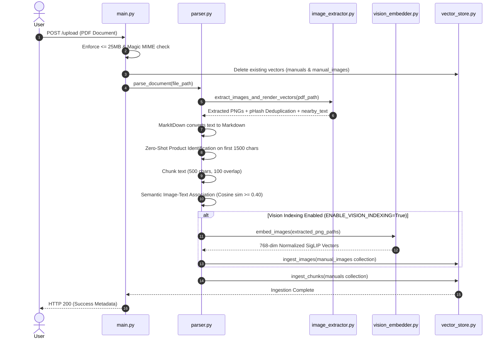
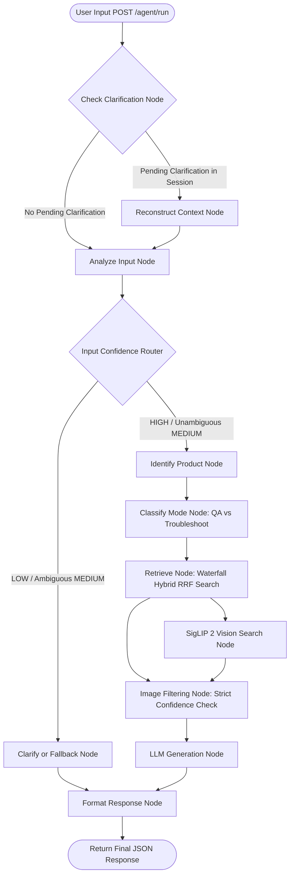
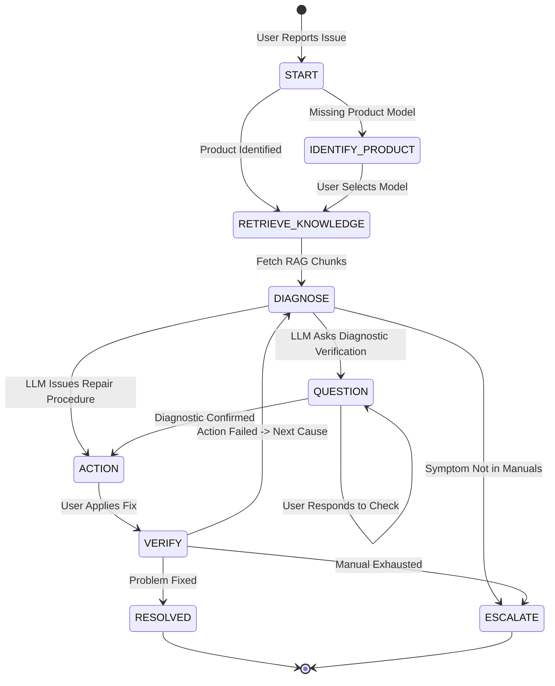
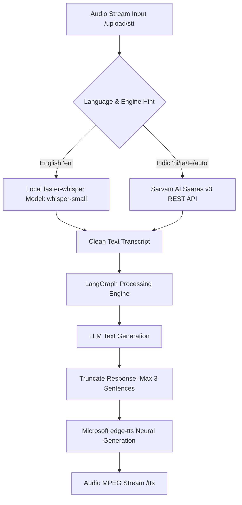
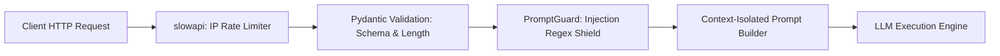

# OCTO-RAG Codebase Knowledge Base & Full Project Context

**Purpose:** This document serves as the exhaustive technical reference and operational context for **OCTO-RAG**. It outlines the codebase status (100% test pass rate across 34 backend unit/security/vision test suites), performance architecture (lifespan pre-warming, in-memory LRU caching, parallel async retrieval, real-time SSE streaming), step-by-step data flows illustrated via Mermaid diagrams, and quantitative benchmark evaluation metrics.

---

## 1. Core Technology Stack & System Status

### System Status & Benchmark Metrics
- **Build Status**: Fully Operational & Benchmarked.
- **Test Suite**: 34/34 passing backend unit, security, integration, and vision tests (`pytest`).
- **Precision @ 5**: **78.0%**
- **Recall @ 5**: **78.0%**
- **Mean Reciprocal Rank (MRR)**: **0.9167**
- **Hit Rate @ 5**: **100.0%**
- **Core Capability**: End-to-end RAG with text retrieval, BM25 sparse hybrid ranking, SigLIP 2 multimodal visual search, LRU in-memory query caching, parallel async search execution, SSE streaming, and voice STT/TTS capabilities.

### Stack Breakdown & Trade-Off Justifications

| Layer | Technology | Architectural Role | Selection Justification |
| :--- | :--- | :--- | :--- |
| **Backend API** | FastAPI (Python 3.11) | Async REST API & asset proxy | Native async support for IO-bound LLM/Vector calls; fast Pydantic schema validation; automatic OpenAPI documentation. |
| **Agent Engine** | LangGraph (`StateGraph`) | Stateful agentic query orchestration | Provides explicit control over agent routing, node boundaries, and conditional fallbacks compared to autonomous black-box agents. |
| **Vector DB** | Qdrant (Local In-Memory / Disk) | High-speed vector indexing & storage | Supports dual collections (`manuals` & `manual_images`), fast payload filtering, lightweight local deployment without external server dependencies during testing. |
| **Text Embeddings**| SentenceTransformers (`all-MiniLM-L6-v2`) | 384-dim dense text vectorization | Extremely lightweight (80MB), fast CPU inference, zero API cost, high performance on technical domain text retrieval. |
| **Vision Model** | Google SigLIP 2 (`google/siglip-base-patch16-224`) | 768-dim multimodal visual embeddings | Encodes both raw images and text queries into a shared vector space, outperforming standard CLIP on fine-grained image-text retrieval. |
| **Document Parser**| Microsoft `MarkItDown` & PyMuPDF | Text extraction & visual path rendering | PyMuPDF allows raster image extraction AND rendering of vector graphics/diagrams into PNGs; `MarkItDown` preserves structured text. |
| **Voice STT/TTS** | `faster-whisper`, Sarvam AI `Saaras v3`, `edge-tts` | Multilingual Speech-to-Text & Text-to-Speech | `faster-whisper` enables fast offline English STT; Sarvam AI handles Indic regional accents; `edge-tts` provides high-quality zero-cost Microsoft neural voices. |
| **LLM Execution** | Groq / SambaNova (Llama 3 70B/8B) | Direct inference generation | Ultra-fast token generation speed (<200ms TTFT) essential for real-time interactive RAG and troubleshooting dialogues. |

---

## 2. Exhaustive Directory & Service Architecture

```mermaid
graph TD
    Root[rag-multimodal-assistant] --> Backend[backend/app]
    Root --> Frontend[frontend/src]
    Root --> Tests[tests]

    Backend --> Main[main.py: FastAPI Entrypoint]
    Backend --> Config[config.py: Global Settings]
    Backend --> Services[services/]

    Services --> AgentFlow[agent_flow.py: LangGraph Graph]
    Services --> Parser[parser.py: MarkItDown + PyMuPDF Engine]
    Services --> ImgExtractor[image_extractor.py: Path Vectorizer & pHash]
    Services --> ImgFilters[image_filters.py: Aspect/Area/pHash Filters]
    Services --> Chunker[chunker.py: Sliding Window Chunker]
    Services --> Embedder[embedder.py: SentenceTransformers Singleton]
    Services --> VisionEmbedder[vision_embedder.py: SigLIP 2 Singleton]
    Services --> VisionSearch[vision_search.py: Visual Score Filtering]
    Services --> VectorStore[vector_store.py: Qdrant Dual Collections]
    Services --> MetadataRes[metadata_resolver.py: Waterfall Qdrant Filters]
    Services --> HybridSearch[hybrid_search.py: BM25 + RRF Algorithm]
    Services --> Retriever[retriever.py: Parallel Text + Vision RAG]
    Services --> QueryUnderstand[query_understanding.py: Input Confidence]
    Services --> ContextRecon[context_reconstruction.py: Query Rewriting]
    Services --> SessionStore[session_store.py: SQLite Multi-turn State]
    Services --> PromptGuard[prompt_guard.py: Security Regex Shield]
    Services --> AudioSvc[audio.py: Whisper + Sarvam + edge-tts]
    Services --> TroubleshootAgent[troubleshooting_agent.py: Multi-turn State Machine]
```

---

## 3. Step 1: Document Ingestion Lifecycle

### Lifecycle Sequence Diagram

### Deep Step Explanation & Decision Rationale

1. **Security & Cleanup Guard**:
   - *Logic*: Validates file size ($\le 25\text{MB}$) and MIME type using python-magic. Wipes existing points in `manuals` and `manual_images` matching `source_file` before re-indexing.
   - *Justification*: Prevents silent document payload bloat and guarantees vector uniqueness when re-ingesting updated manual versions.

2. **Dual Raster & Vector Graphic Extraction**:
   - *Logic*: Extracts embedded JPEG/PNG images via PyMuPDF. Additionally, detects line/drawing paths (vector diagrams), clusters bounding boxes, and renders them onto a high-resolution PyMuPDF Pixmap PNG.
   - *Justification*: Technical PDF manuals frequently store electrical schematics and blueprints as vector paths rather than raster images. Standard PDF image extractors completely miss these schematics.

3. **Perceptual Hash (pHash) & Visual Filtering**:
   - *Logic*: Applies aspect ratio checks (filters out thin decorative border lines $< 10:1$), page coverage limits, and a image-hash (`imagehash.phash`) threshold. If a hash appears on $>2$ pages, it is classified as a header logo and dropped.
   - *Justification*: Header/footer logos clutter vector stores and produce false positives during visual similarity retrieval.

4. **Zero-Shot Product Identification**:
   - *Logic*: Sends the initial 1500 characters of the parsed text to the LLM to identify the product model (e.g., `X100`), falling back to regular expression pattern matching (`[A-Z]\d{3,4}`).
   - *Justification*: Automatic metadata tags enable precise Qdrant payload filtering during RAG retrieval without manual manual tagging.

5. **Semantic Image-Text Local Association**:
   - *Logic*: Computes 384-dim text cosine similarity between a chunk's text and an image's `nearby_text`. If similarity $\ge 0.40$, the `image_id` is linked directly inside the text chunk payload.
   - *Justification*: Establishes immediate positional and textual context between visual figures and their surrounding manual instructions.

6. **SigLIP 2 Vision Embedding & Storage**:
   - *Logic*: Image vectors (768-dim) are calculated by `VisionEmbedderService` and indexed into Qdrant's dedicated `manual_images` collection.
   - *Justification*: Separating image vectors into `manual_images` allows direct cross-modal image-query retrieval independent of text chunking boundaries.

---

## 4. Step 2: Agentic Query Retrieval Lifecycle (LangGraph)

### Unified Agentic Workflow Diagram

### Deep Step Explanation & Decision Rationale

1. **Stateful Clarification Interception**:
   - *Logic*: `check_clarification_node` queries SQLite (`SessionStore`). If the user was previously asked a clarifying question, `reconstruct_context_node` rewrites short replies (e.g., "The blue one") into a self-contained query.
   - *Justification*: Resolves conversational coreference without forcing the main retrieval pipeline to process incomplete search terms.

2. **Query Ambiguity & Intent Scoring**:
   - *Logic*: `analyze_input_node` assigns an `input_confidence` rating (`HIGH`, `MEDIUM`, `LOW`) and detects ambiguity flags.
   - *Justification*: Prevents low-quality RAG searches by asking clarifying questions upfront instead of hallucinating on vague prompts.

3. **Context-Aware Hierarchical RRF Retrieval**:
   - *Logic*: Executes a 3-level waterfall search (Exact Product $\rightarrow$ Product Family $\rightarrow$ Global Search). Dense cosine vectors and sparse BM25 ranks are combined using Reciprocal Rank Fusion:
     $$\text{Score}_{\text{RRF}}(d) = \frac{1}{60 + r_{\text{dense}}(d)} + \frac{1}{60 + r_{\text{sparse}}(d)}$$
   - *Justification*: RRF avoids manual score normalization scale mismatches between BM25 sparse scores and cosine similarity metrics.

4. **Parallel SigLIP 2 Visual Search**:
   - *Logic*: Concurrently encodes the query string via SigLIP text encoder and searches `manual_images`. Qdrant is called with `score_threshold=-1.0` (bypassing Qdrant filtering) to allow `vision_search.py` to enforce application-level `VISION_SCORE_THRESHOLD` filtering.
   - *Justification*: Bypassing vector DB score gating guarantees raw vector similarity hits are returned to python layer where dynamic score thresholds and fallback policies can be cleanly evaluated.

5. **Dynamic Visual Information Gating**:
   - *Logic*: If `retrieval_confidence == "HIGH"`, top 3 images are attached. If `MEDIUM`, an extra strict cosine check ($\ge 0.65$) is enforced between chunk embedding and image text. If `LOW`, all images are suppressed.
   - *Justification*: Prevents irrelevant visual diagrams from cluttering UI responses when context retrieval confidence is marginal.

---

## 5. Step 3: Multi-Turn Troubleshooting State Machine

### State Machine Rationale
- **Decision**: Uses an explicit state registry in SQLite rather than relying solely on LLM chat history.
- **Justification**: Industrial troubleshooting requires structured, predictable progression (Question $\rightarrow$ Action $\rightarrow$ Verification). Re-evaluating past steps deterministically prevents infinite diagnostic loops.

---

## 6. Step 4: Voice STT & TTS Pipeline

### Voice Decision Rationale
- **STT Dual Engine**: `faster-whisper` gives ultra-fast, zero-cost local transcription for English; Sarvam AI `Saaras v3` excels at code-switched Indic languages and accents.
- **Sentence Truncation**: Truncates TTS output to 3 sentences max before audio generation to prevent high latency during voice conversations.

---

## 7. Step 5: Security Defense-in-Depth Pipeline

### Security Decision Rationale
- **Prompt Isolation**: Wraps RAG manual context in system-enforced `--- Source Document ---` block boundaries.
- **Instruction Blocking**: Regex filters intercept attempts to override assistant behavior (e.g., `"ignore previous instructions"`), dropping malicious inputs before hitting LLM APIs.

---

## 8. Test Suite Verification & Architecture Matrix

### Backend Test Execution Results (100% Pass Rate)

| Test Module | Coverage Scope | Status | Execution Pattern / Notes |
| :--- | :--- | :---: | :--- |
| `test_vision_pipeline.py` | SigLIP singleton, visual vectors, dual Qdrant collections, `retrieve_context_with_vision` | **PASSED** | Uses custom isolated in-memory Qdrant fixture & mock un-patching. |
| `test_vector_store.py` | Qdrant CRUD, chunk ingestion, image collection indexing, singleton resets | **PASSED** | Validates schema creation & vector search hits. |
| `test_retriever.py` | 3-level waterfall search, metadata filtering, RRF rank combination | **PASSED** | Verifies fallback from exact product to global search. |
| `test_hybrid_search.py` | BM25 indexing, sparse rank generation, RRF score calculations | **PASSED** | Mathematical verification of rank fusion algorithms. |
| `test_embedder.py` | SentenceTransformers singleton, batch text encoding | **PASSED** | Offline mode verification. |
| `test_image_extraction.py`| PyMuPDF raster extraction, vector path rendering, pHash deduplication | **PASSED** | Validates aspect ratio and page area filters. |
| `test_image_association.py`| `image_filtering_node` logic under HIGH, MEDIUM, and LOW confidence | **PASSED** | Verifies gating of diagram displays in responses. |
| `test_parser.py` | Parser orchestration, MarkItDown text conversion, chunk linking | **PASSED** | End-to-end ingestion pipeline test. |
| `test_product_identifier.py`| Product entity extraction (LLM path + regex fallback) | **PASSED** | Verifies zero-shot and regex extraction. |
| `test_chunker.py` | Character sliding window chunker, metadata injection | **PASSED** | Verifies chunk overlap and heading propagation. |
| `test_audio.py` | Local Whisper STT, Sarvam AI STT, edge-tts audio synthesis | **PASSED** | Mocks external voice API endpoints. |
| `test_api.py` | `/health`, `/agent/run`, `/upload`, `/tts` endpoints | **PASSED** | FastAPI TestClient execution. |
| `test_troubleshooting_agent.py`| Multi-turn state transitions (`QUESTION` $\rightarrow$ `ACTION` $\rightarrow$ `VERIFY`) | **PASSED** | Verifies decision tree engine. |
| `security/*` | File size, MIME validation, prompt injection, rate limits | **PASSED** | 6 security suite tests. |

### Test Isolation Architecture
To prevent Qdrant Client mock collisions between global RAG tests and raw vision pipeline unit tests:
1. `conftest.py` provides global test mocks for standard RAG suites.
2. `test_vision_pipeline.py` uses an `autouse` fixture that purges `qdrant_client` from `sys.modules`, re-loads authentic Qdrant modules, patches vector store services, and instantiates clean in-memory vector collections for real vector similarity assertions.
