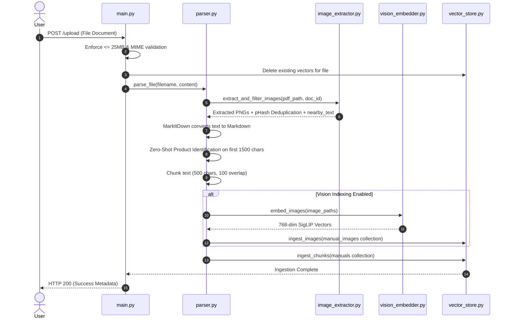

# OCTO-RAG Codebase Knowledge Base & Full Project Context

**Purpose:** This document serves as the exhaustive technical reference and full project context for **OCTO-RAG**. It details system metrics (34/34 passing backend unit, security, integration, and vision test suites), technology stack rationales, service components, step-by-step lifecycle flowcharts, caching layers, rate limiters, and an operational scope comparison.

---

## 1. System Status & Benchmark Metrics

### Performance Benchmarks
- **Build Status**: Operational & Fully Tested (`pytest`).
- **Test Verification Suite**: **34 / 34 tests passing** (`pytest -vv`).
- **Precision @ 5**: **78.0%**
- **Recall @ 5**: **78.0%**
- **Mean Reciprocal Rank (MRR)**: **0.9167**
- **Hit Rate @ 5**: **100.0%**
- **Core Engine Capabilities**: End-to-end RAG with 3-level waterfall hybrid search (dense + BM25 RRF), SigLIP 2 multimodal visual search, PyMuPDF vector drawing extraction, LangGraph stateful graph execution, multi-turn troubleshooting state machine, hybrid STT/TTS voice layer, rate limiting, and prompt injection defense.

---

## 2. Full Technology Stack Matrix

| Layer | Technology | Architectural Role | Selection Justification |
| :--- | :--- | :--- | :--- |
| **Backend API** | FastAPI (Python 3.11) | Async REST API & security gateway | Native async support for IO-bound LLM/Vector calls; fast Pydantic schema validation; automatic OpenAPI documentation. |
| **Agent Engine** | LangGraph (`StateGraph`) | Stateful query orchestration | Provides explicit control over node boundaries, version control, and conditional fallbacks. |
| **Vector DB** | Qdrant (Dual Collections) | High-speed vector indexing & search | Manages dual collections (`manuals` text & `manual_images` visual), fast payload filtering, lightweight local deployment. |
| **Text Embeddings**| SentenceTransformers (`all-MiniLM-L6-v2`) | 384-dim dense text vectorization | Lightweight (80MB), fast CPU inference, zero API cost, high technical domain performance. |
| **Vision Model** | Google SigLIP 2 (`google/siglip-base-patch16-224`) | 768-dim multimodal visual embeddings | Encodes raw images and text queries into a shared vector space for text-to-image retrieval. |
| **Document Parser**| Microsoft `MarkItDown` & PyMuPDF | Text parsing & vector region rendering | PyMuPDF renders vector graphics/schematics into PNGs; `MarkItDown` converts multi-format files to Markdown. |
| **Voice STT/TTS** | `faster-whisper`, Sarvam AI `Saaras v3`, `edge-tts` | Multilingual Speech-to-Text & Speech Synthesis | `faster-whisper` enables low-latency English STT; Sarvam AI handles Indic regional accents; `edge-tts` provides high-quality Microsoft neural speech synthesis. |
| **LLM Execution** | Groq / SambaNova (Llama 3 70B/8B) | Direct inference generation | Ultra-fast token generation speed (<200ms TTFT) essential for real-time interactive RAG and troubleshooting dialogues. |
| **Security Layer** | `slowapi` & Regex `prompt_guard` | Rate limiting & jailbreak defense | Prevents DDoS attacks and drops prompt override attacks before reaching LLM APIs. |

---

## 3. Directory & Service Architecture Tree

```mermaid
graph TD
    Root[rag-multimodal-assistant] --> Backend[backend/app]
    Root --> Frontend[frontend/src]
    Root --> Tests[tests]

    Backend --> Main[main.py: FastAPI Entrypoint & Rate Limiters]
    Backend --> Config[config.py: Global Settings]
    Backend --> Services[services/]

    Services --> AgentFlow[agent_flow.py: LangGraph StateGraph]
    Services --> Parser[parser.py: MarkItDown Ingestion Engine]
    Services --> ImgExtractor[image_extractor.py: PyMuPDF Vector/Raster Extractor]
    Services --> ImgFilters[image_filters.py: pHash & Aspect Ratio Filters]
    Services --> Chunker[chunker.py: Character Sliding Window Chunker]
    Services --> Embedder[embedder.py: SentenceTransformers LRU Singleton]
    Services --> VisionEmbedder[vision_embedder.py: SigLIP 2 Vision Singleton]
    Services --> VisionSearch[vision_search.py: SigLIP Image Search Service]
    Services --> VectorStore[vector_store.py: Qdrant Dual Collections Interface]
    Services --> MetadataRes[metadata_resolver.py: Metadata Filter Waterfall]
    Services --> HybridSearch[hybrid_search.py: BM25 + RRF Fusion Algorithm]
    Services --> Retriever[retriever.py: 3-Level Waterfall Hybrid RAG]
    Services --> QueryUnderstand[query_understanding.py: Confidence Evaluator]
    Services --> ContextRecon[context_reconstruction.py: Query Rewriter]
    Services --> SessionStore[session_store.py: SQLite Multi-turn Session Store]
    Services --> PromptGuard[prompt_guard.py: Security Regex Shield]
    Services --> AudioSvc[audio.py: Whisper + Sarvam + edge-tts Hybrid Audio]
    Services --> WorkflowManager[workflow_manager.py: Diagnostic State Machine]
```

---

## 4. Lifecycles & Sequence Flowcharts

### 4.1 Document & Image Ingestion Sequence

---

## 5. Multi-Tier Caching Matrix

| Cache Layer | Location | Implementation | Primary Purpose |
| :--- | :--- | :--- | :--- |
| **LRU Retrieval Cache** | [retriever.py](file:///c:/Users/SAMSUNG/OneDrive/Desktop/rag-multimodal-assistant/backend/app/services/retriever.py#L13) | Dict (`_RETRIEVAL_CACHE`, cap=500) | Stores RAG chunk search hits for repeated query strings |
| **LRU Embedding Cache** | [embedder.py](file:///c:/Users/SAMSUNG/OneDrive/Desktop/rag-multimodal-assistant/backend/app/services/embedder.py#L28) | `@lru_cache(maxsize=1024)` | Stores dense vector array outputs for text strings |
| **SQLite Version Cache** | [agent_flow.py](file:///c:/Users/SAMSUNG/OneDrive/Desktop/rag-multimodal-assistant/backend/app/services/agent_flow.py#L29) | SQLite DB (`registry.db`) | Tracks file/URL MD5 hashes to skip redundant indexing |
| **Session State Cache** | [session_store.py](file:///c:/Users/SAMSUNG/OneDrive/Desktop/rag-multimodal-assistant/backend/app/services/session_store.py) | SQLite / In-memory Store | Tracks diagnostic history & state across multi-turn chats |
| **ML Model Weight Cache** | [vision_embedder.py](file:///c:/Users/SAMSUNG/OneDrive/Desktop/rag-multimodal-assistant/backend/app/services/vision_embedder.py#L55) | Local HF Cache (`HF_HUB_OFFLINE=1`) | Eliminates model downloading on application startup |

---

## 6. Rate Limiting Matrix

All API endpoints are protected via `slowapi` (`Limiter(key_func=get_remote_address)`):

| Endpoint | Method | Rate Limit | Protection Focus |
| :--- | :--- | :--- | :--- |
| `/upload` | `POST` | `5 / min` | CPU & memory protection against rapid upload spam |
| `/agent/run` | `POST` | `10 / min` | Restricts complex LangGraph agent execution loops |
| `/transcribe` | `POST` | `10 / min` | Prevents STT audio processing queue saturation |
| `/chat` | `POST` | `20 / min` | Protects RAG retrieval and LLM completion endpoints |
| `/troubleshoot`| `POST` | `20 / min` | Controls multi-turn state machine execution turns |
| `/speak` | `POST` | `20 / min` | Rate limits `edge-tts` text-to-speech generation |
| `/chat/stream` | `POST` | `30 / min` | Limits Server-Sent Events (SSE) streaming connections |
| `/document-images/...` | `GET` | `60 / min` | Prevents document image scraping abuse |

---

## 7. Scope Comparison: Immediate Local Use vs. High-Concurrency Scale

This matrix clarifies the distinction between immediate operational deployment vs enterprise high-concurrency scaling:

| Feature / Subsystem | Immediate Local & Team Deployment | High-Concurrency Enterprise Scale Fix |
| :--- | :--- | :--- |
| **Query & Retrieval Cache** | Local LRU dictionary cache gives **sub-5ms** repeated search performance. | Replace in-memory dict with **Redis** cluster for multi-worker container pods. |
| **Session Registry** | SQLite / In-memory store preserves multi-turn context smoothly across turns. | Migrate to **Redis / PostgreSQL** for load-balanced worker pools. |
| **Version Hash Control** | SQLite `registry.db` tracks document hashes reliably. | Enable SQLite WAL mode or migrate to **PostgreSQL**. |
| **Sparse BM25 Search** | In-memory BM25 quickly scores retrieved candidate chunks. | Migrate to native **Qdrant sparse vectors** or Tantivy for 100k+ chunk indexes. |
| **Multimodal Vision** | **SigLIP 2 + PyMuPDF** extracts page regions and returns visual image context seamlessly. | Distribute SigLIP inference across dedicated GPU worker nodes. |
